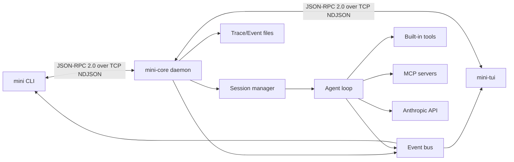

# MiniClaude

[](https://www.python.org/)
[](https://docs.astral.sh/uv/)
[](./LICENSE)
[](#architecture)
[](#核心能力)

MiniClaude is a locally-prioritized AI Agent system: `mini-core` acts as a resident daemon responsible for sessions, tools, event streams, permission approval, and LLM calls, while `mini` and `mini-tui` act as clients communicating with it via TCP loopback.

It is not merely a CLI script wrapped around an API, but an observable, extensible, and continuously iteratable agent runtime. You can use the CLI for scripted verification, use the TUI for multi-turn interaction, or integrate new frontends and automation tools via the JSON-RPC/NDJSON protocol.

> Current version: `0.0.1`. The project is still in rapid iteration; the README reflects the current implementation in the repository.

## Table of Contents

- [Why MiniClaude](#为什么是-miniclaude)
- [Core Capabilities](#核心能力)
- [Quick Start](#快速开始)
- [Common Commands](#常用命令)
- [Architecture](#architecture)
- [Configuration & Local Data](#配置与本地数据)
- [Development & Verification](#开发与验证)
- [Documentation Map](#文档地图)

## Why MiniClaude

The core design goal of MiniClaude is to split an agent into a clear local system, rather than stuffing all state into a one-off CLI process.

- **Resident Core**: `mini-core` centrally manages sessions, runs, traces, permission policies, and MCP server lifecycles.
- **Dual-Entry Interaction**: `mini-tui` serves as the primary interactive interface, while the `mini` CLI is suited for quick testing, scripted calls, and debugging.
- **Event-Driven**: Clients subscribe to events like `run.*`, `tool.*`, `llm.token`, `permission.*`, enabling real-time rendering of the agent's execution process.
- **Auditable Execution Traces**: Traces record key data at the IPC, event, and LLM layers, facilitating playback, debugging, and performance analysis.
- **Permissions First**: Tool calls go through permission approval, with options to allow once, allow always, deny once, or deny always.
- **Extensible Tool Surface**: Built-in tools for files, shell, tasks, notes, and subagents, plus support for integrating external tools via MCP.

## Core Capabilities

| Capability | Current Implementation |
|------|----------|
| Core daemon | `mini-core` listens on `127.0.0.1:7437`, handling JSON-RPC commands and event broadcasts |
| CLI | `mini ping`, `mini chat`, `mini run`, `mini core`, `mini trace` |
| TUI | `mini-tui` provides a Textual terminal interface, supporting chat, streaming output, tool blocks, permission approval, and replay |
| One-shot run | `mini run --goal "..."` creates a one-shot session and executes agent tasks |
| Multi-turn chat | `mini chat` / `mini-tui` creates a persistent chat session |
| Event stream | Real-time push of run, step, tool, LLM token, permission, and context compaction events |
| Trace | Written to `~/.mini/traces/daemon.jsonl` by default, viewable and filterable via `mini trace` |
| Built-in tools | `read_file`, `write_file`, `list_dir`, `bash`, task series, `note_save`, subagent tools |
| Permissions | Tool calls support one-time/persistent approval, policies stored in `~/.mini/policy.toml` |
| Memory/Context | Reads `~/.mini/context.md` and `.mini/context.md`, session notes can inject context across turns |
| Compaction | Supports session context compaction, use `/compact` in TUI |
| MCP | Supports stdio / TCP MCP servers, discovered MCP tools are injected into the agent tool registry |

## Quick Start

### Environment Requirements

| Dependency | Version |
|------|--------|
| OS | macOS / Linux |
| Python | 3.12.x |
| [uv](https://docs.astral.sh/uv/) | 0.4 or higher |

If `uv` is not yet installed:

```bash
curl -LsSf https://astral.sh/uv/install.sh | sh
```

Python 3.12 is managed automatically by `uv` and usually does not require manual installation.

### Install Dependencies

```bash
git clone <repo-url> miniclaude
cd miniclaude
uv sync
```

### Configure Local Environment

```bash
cp .env.example .env
```

If you only need to verify daemon connectivity, default configuration is sufficient. To run a real agent/chat, configure the Anthropic API key in `.env`:

```bash
ANTHROPIC_API_KEY=sk-ant-...
```

Optional:

```bash
MINI_LLM_DEFAULT_MODEL=claude-sonnet-4-6
MINI_MAX_STEPS=20
```

### Start Core

It is recommended to manage the background daemon via CLI:

```bash
uv run mini core start
uv run mini core status
uv run mini ping
```

Upon success, `mini ping` will output something like:

```text
pong server=0.0.1 uptime=12ms latency=2ms
```

You can also run it in the foreground, which is suitable for observing logs during development:

```bash
uv run mini-core
```

Stop the background daemon:

```bash
uv run mini core stop
```

### Open TUI

```bash
uv run mini-tui
```

The TUI connects to the running `mini-core`, creates a chat session, and displays LLM tokens, tool calls, permission approvals, and session status in real time.

Replay a historical run:

```bash
uv run mini-tui --replay <run-id>
```

### Run a One-Shot Task

```bash
uv run mini run --goal "Summarize the main sections of README.md"
```

`mini run` subscribes to the event stream, triggers the agent run, and prints steps, tool calls, LLM tokens, and the final status to the terminal.

## Common Commands

### User Commands

| Command | Purpose |
|------|--------|
| `uv run mini --version` | Print current package version |
| `uv run mini ping` | Check CLI to core daemon connectivity |
| `uv run mini chat` | Start a CLI multi-turn chat session |
| `uv run mini run --goal "..."` | Execute a one-shot agent task |
| `uv run mini core start` | Start `mini-core` in the background |
| `uv run mini core status` | Check if daemon is running |
| `uv run mini core stop` | Stop background daemon |
| `uv run mini trace` | View trace logs |
| `uv run mini trace <run-id>` | Filter traces by run ID |
| `uv run mini trace --layer llm` | View only LLM layer traces |
| `uv run mini trace --raw --follow` | Continuously track traces in NDJSON format |
| `uv run mini-tui` | Open Textual TUI |
| `uv run mini-tui --replay <run-id>` | Connect and replay historical run events |

### Development Commands

| Command | Purpose |
|------|--------|
| `uv sync` | Install/sync dependencies |
| `uv run ruff check src tests scripts` | Run lint |
| `uv run mypy src` | Run strict type checking |
| `uv run pytest tests/unit -v` | Run unit tests |
| `uv run pytest tests/integration -v` | Run integration tests |
| `make docs` | Regenerate `WIRE_PROTOCOL.md` |
| `make verify-s0` | Execute full S0 verification chain |

## Architecture



### Execution Model

1. After starting, `mini-core` loads configuration, initializes logging, tracing, permission management, MCP servers, and session storage.
2. Clients connect to the core via TCP loopback, sending JSON-RPC 2.0 commands, with each message being a single NDJSON line.
3. `mini run` creates a one-shot session; `mini chat` and `mini-tui` create chat sessions.
4. `SessionManager` passes user messages to `AgentRunner`, which assembles the LLM provider, tool registry, and execution context.
5. Events are generated during agent execution, which the core broadcasts via the event bus to subscribed clients, while simultaneously writing run events and traces.
6. For sensitive tool calls, the permission manager suspends the call and awaits client approval.

### Protocol Boundaries

IPC commands and the event model are defined in `src/mini_claude/core/bus/`. `WIRE_PROTOCOL.md` is generated from these models by `scripts/gen_protocol_doc.py` and should not be edited manually.

## Configuration & Local Data

Configuration priority from lowest to highest:

```text
Built-in defaults -> ~/.mini/config.toml -> .mini/config.toml -> .env -> System environment variables
```

Common environment variables:

| Variable | Default | Purpose |
|------|--------|--------|
| `MINI_CONFIG` | `~/.mini/config.toml` | Specify config file path |
| `MINI_HOST` | `127.0.0.1` | Core daemon listen address |
| `MINI_PORT` | `7437` | Core daemon listen port |
| `MINI_LOG_LEVEL` | `INFO` | Log level |
| `MINI_LOG_FILE` | `~/.mini/logs/core.log` | Core log file |
| `MINI_LOG_FORMAT` | `text` | Log format, supports `text` / `json` |
| `MINI_LLM_DEFAULT_MODEL` | `claude-sonnet-4-6` | Default Anthropic model |
| `MINI_MAX_STEPS` | `20` | Maximum steps per agent run |
| `MINI_TRACE_ENABLED` | `true` | Enable tracing |
| `MINI_TRACE_FILE` | `~/.mini/traces/daemon.jsonl` | Trace file location |
| `MINI_PERMISSION_TIMEOUT_S` | `60` | Permission approval timeout, `0` means no timeout |
| `MINI_COMPACT_THRESHOLD` | `0` | Auto-compaction trigger threshold, `0` means disabled |

Local data locations:

| Path | Content |
|------|--------|
| `~/.mini/logs/core.log` | Core daemon logs |
| `~/.mini/logs/tui.log` | TUI logs |
| `~/.mini/traces/daemon.jsonl` | IPC, event, LLM traces |
| `~/.mini/sessions/` | Sessions, run events, notes, summaries |
| `~/.mini/policy.toml` | Persistent permission policies |
| `~/.mini/context.md` | Global context |
| `.mini/context.md` | Current project context |

For more complete configuration examples, troubleshooting, and daily operations, see [RUNBOOK.md](./RUNBOOK.md).

## Development & Verification

MiniClaude uses a `src/` layout, Hatchling for building, and the Ruff + mypy + pytest toolchain.

```bash
uv sync
uv run ruff check src tests scripts
uv run mypy src
uv run pytest tests/unit -v
```

After modifying protocol models, regenerate the protocol documentation:

```bash
make docs
```

Recommended to run before committing:

```bash
make verify-s0
```

`make verify-s0` executes dependency sync, linting, type checking, unit tests, ping integration tests, and a source check for `WIRE_PROTOCOL.md`.

## Documentation Map

- [RUNBOOK.md](./RUNBOOK.md): Daily operations, configuration, logs, development commands, and troubleshooting.
- [WIRE_PROTOCOL.md](./WIRE_PROTOCOL.md): IPC protocol documentation generated from code.
- [AGENT.md](./AGENT.md): Repository work guide for Codex/agents.
- [CLAUDE.md](./CLAUDE.md): Repository work guide for Claude Code.
- [LICENSE](./LICENSE): MIT License.
