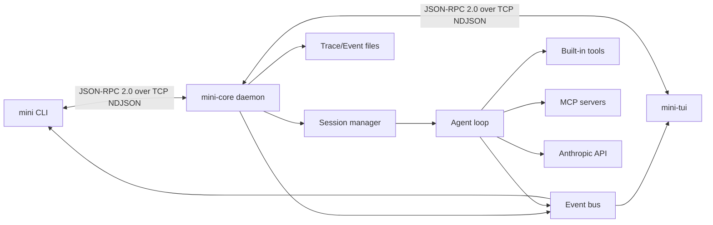

# MiniClaude

[](https://www.python.org/)
[](https://docs.astral.sh/uv/)
[](./LICENSE)
[](#architecture)
[](#核心能力)

MiniClaude 是一个本地优先的 AI Agent 系统：`mini-core` 作为常驻守护进程负责
session、工具、事件流、权限审批和 LLM 调用，`mini` 与 `mini-tui` 作为客户端通过
TCP loopback 与它通信。

它不是一个只包了一层 API 的命令行脚本，而是一套可观察、可扩展、可持续迭代的
agent runtime。你可以用 CLI 做脚本化验证，用 TUI 进行多轮交互，也可以通过
JSON-RPC/NDJSON 协议接入新的前端或自动化工具。

> 当前版本：`0.0.1`。项目仍处于快速迭代阶段，README 以当前仓库中的实现为准。

## 目录

- [为什么是 MiniClaude](#为什么是-miniclaude)
- [核心能力](#核心能力)
- [快速开始](#快速开始)
- [常用命令](#常用命令)
- [Architecture](#architecture)
- [配置与本地数据](#配置与本地数据)
- [开发与验证](#开发与验证)
- [文档地图](#文档地图)

## 为什么是 MiniClaude

MiniClaude 的核心设计目标是把一个 agent 拆成清晰的本地系统，而不是把所有状态塞进
一次性的 CLI 进程里。

- **长驻 core**：`mini-core` 统一管理 session、run、trace、权限策略和 MCP server
  生命周期。
- **双入口交互**：`mini-tui` 是主要交互界面，`mini` CLI 适合快速测试、脚本调用和调试。
- **事件驱动**：客户端订阅 `run.*`、`tool.*`、`llm.token`、`permission.*` 等事件，
  可以实时渲染 agent 的执行过程。
- **可审计运行轨迹**：trace 记录 IPC、事件和 LLM 层面的关键数据，方便回放、排错和性能分析。
- **权限优先**：工具调用经过权限审批，可选择一次允许、始终允许、一次拒绝或始终拒绝。
- **可扩展工具面**：内置文件、shell、任务、笔记和 subagent 工具，同时支持通过 MCP 接入外部工具。

## 核心能力

| 能力 | 当前实现 |
|------|----------|
| Core daemon | `mini-core` 监听 `127.0.0.1:7437`，处理 JSON-RPC 命令和事件广播 |
| CLI | `mini ping`、`mini chat`、`mini run`、`mini core`、`mini trace` |
| TUI | `mini-tui` 提供 Textual 终端界面，支持聊天、流式输出、工具块、权限审批和 replay |
| One-shot run | `mini run --goal "..."` 创建一次性 session 并执行 agent 任务 |
| Multi-turn chat | `mini chat` / `mini-tui` 创建可持续对话的 chat session |
| Event stream | run、step、tool、LLM token、permission、context compaction 等事件实时推送 |
| Trace | 默认写入 `~/.mini/traces/daemon.jsonl`，可用 `mini trace` 查看和过滤 |
| Built-in tools | `read_file`、`write_file`、`list_dir`、`bash`、task 系列、`note_save`、subagent 工具 |
| Permissions | 工具调用支持一次性/持久化审批，策略存储在 `~/.mini/policy.toml` |
| Memory/context | 读取 `~/.mini/context.md` 与 `.mini/context.md`，session notes 可跨轮注入上下文 |
| Compaction | 支持 session 上下文压缩，TUI 中可使用 `/compact` |
| MCP | 支持 stdio / TCP MCP server，发现的 MCP 工具会注入 agent 工具注册表 |

## 快速开始

### 环境要求

| 依赖 | 版本 |
|------|------|
| 操作系统 | macOS / Linux |
| Python | 3.12.x |
| [uv](https://docs.astral.sh/uv/) | 0.4 或更高 |

如果还没有安装 `uv`：

```bash
curl -LsSf https://astral.sh/uv/install.sh | sh
```

Python 3.12 由 `uv` 自动管理，通常不需要手动安装。

### 安装依赖

```bash
git clone <repo-url> miniclaude
cd miniclaude
uv sync
```

### 配置本机环境

```bash
cp .env.example .env
```

如果只验证 daemon 连通性，默认配置即可。若要运行真正的 agent/chat，需要在 `.env`
中配置 Anthropic API key：

```bash
ANTHROPIC_API_KEY=sk-ant-...
```

可选项：

```bash
MINI_LLM_DEFAULT_MODEL=claude-sonnet-4-6
MINI_MAX_STEPS=20
```

### 启动 core

推荐用 CLI 管理后台 daemon：

```bash
uv run mini core start
uv run mini core status
uv run mini ping
```

成功时 `mini ping` 会输出类似：

```text
pong server=0.0.1 uptime=12ms latency=2ms
```

也可以前台启动，适合开发时观察日志：

```bash
uv run mini-core
```

停止后台 daemon：

```bash
uv run mini core stop
```

### 打开 TUI

```bash
uv run mini-tui
```

TUI 会连接正在运行的 `mini-core`，创建 chat session，并实时显示 LLM token、工具调用、
权限审批和 session 状态。

回放历史 run：

```bash
uv run mini-tui --replay <run-id>
```

### 运行一次性任务

```bash
uv run mini run --goal "总结 README.md 的主要章节"
```

`mini run` 会订阅事件流、触发 agent run，并在终端中打印 step、tool、LLM token 和
最终状态。

## 常用命令

### 用户命令

| 命令 | 用途 |
|------|------|
| `uv run mini --version` | 输出当前包版本 |
| `uv run mini ping` | 检查 CLI 到 core daemon 的连通性 |
| `uv run mini chat` | 启动 CLI 多轮聊天 session |
| `uv run mini run --goal "..."` | 执行一次 one-shot agent 任务 |
| `uv run mini core start` | 后台启动 `mini-core` |
| `uv run mini core status` | 查看 daemon 是否正在运行 |
| `uv run mini core stop` | 停止后台 daemon |
| `uv run mini trace` | 查看 trace 日志 |
| `uv run mini trace <run-id>` | 按 run ID 过滤 trace |
| `uv run mini trace --layer llm` | 只看 LLM 层 trace |
| `uv run mini trace --raw --follow` | 以 NDJSON 形式持续跟踪 trace |
| `uv run mini-tui` | 打开 Textual TUI |
| `uv run mini-tui --replay <run-id>` | 连接后回放历史 run 事件 |

### 开发命令

| 命令 | 用途 |
|------|------|
| `uv sync` | 安装/同步依赖 |
| `uv run ruff check src tests scripts` | 运行 lint |
| `uv run mypy src` | 运行严格类型检查 |
| `uv run pytest tests/unit -v` | 运行单元测试 |
| `uv run pytest tests/integration -v` | 运行集成测试 |
| `make docs` | 重新生成 `WIRE_PROTOCOL.md` |
| `make verify-s0` | 执行完整 S0 验证链路 |

## Architecture



### 运行模型

1. `mini-core` 启动后加载配置、初始化日志、trace、权限管理器、MCP server 和 session store。
2. 客户端通过 TCP loopback 连接 core，发送 JSON-RPC 2.0 命令，每条消息都是一行 NDJSON。
3. `mini run` 创建 one-shot session；`mini chat` 和 `mini-tui` 创建 chat session。
4. `SessionManager` 把用户消息交给 `AgentRunner`，runner 组装 LLM provider、工具注册表和执行上下文。
5. agent 执行过程中产生事件，core 通过 event bus 广播给已订阅的客户端，同时写入 run events 和 trace。
6. 需要敏感工具调用时，permission manager 会挂起调用并等待客户端审批。

### 协议边界

IPC 命令和事件模型定义在 `src/mini_claude/core/bus/`。`WIRE_PROTOCOL.md` 由
`scripts/gen_protocol_doc.py` 从这些模型生成，不应手动编辑。

## 配置与本地数据

配置优先级从低到高：

```text
内建默认值 -> ~/.mini/config.toml -> .mini/config.toml -> .env -> 系统环境变量
```

常用环境变量：

| 变量 | 默认值 | 用途 |
|------|--------|------|
| `MINI_CONFIG` | `~/.mini/config.toml` | 指定配置文件路径 |
| `MINI_HOST` | `127.0.0.1` | core daemon 监听地址 |
| `MINI_PORT` | `7437` | core daemon 监听端口 |
| `MINI_LOG_LEVEL` | `INFO` | 日志级别 |
| `MINI_LOG_FILE` | `~/.mini/logs/core.log` | core 日志文件 |
| `MINI_LOG_FORMAT` | `text` | 日志格式，支持 `text` / `json` |
| `MINI_LLM_DEFAULT_MODEL` | `claude-sonnet-4-6` | 默认 Anthropic 模型 |
| `MINI_MAX_STEPS` | `20` | 单次 agent run 最大步数 |
| `MINI_TRACE_ENABLED` | `true` | 是否启用 trace |
| `MINI_TRACE_FILE` | `~/.mini/traces/daemon.jsonl` | trace 文件位置 |
| `MINI_PERMISSION_TIMEOUT_S` | `60` | 权限审批超时时间，`0` 表示不超时 |
| `MINI_COMPACT_THRESHOLD` | `0` | 自动压缩触发阈值，`0` 表示禁用 |

本地数据位置：

| 路径 | 内容 |
|------|------|
| `~/.mini/logs/core.log` | core daemon 日志 |
| `~/.mini/logs/tui.log` | TUI 日志 |
| `~/.mini/traces/daemon.jsonl` | IPC、event、LLM trace |
| `~/.mini/sessions/` | session、run events、notes、summary |
| `~/.mini/policy.toml` | 持久化权限策略 |
| `~/.mini/context.md` | 全局上下文 |
| `.mini/context.md` | 当前项目上下文 |

更完整的配置示例、故障排查和日常操作见 [RUNBOOK.md](./RUNBOOK.md)。

## 开发与验证

MiniClaude 使用 `src/` 布局、Hatchling 构建、Ruff + mypy + pytest 工具链。

```bash
uv sync
uv run ruff check src tests scripts
uv run mypy src
uv run pytest tests/unit -v
```

改动协议模型后重新生成协议文档：

```bash
make docs
```

提交前建议运行：

```bash
make verify-s0
```

`make verify-s0` 会执行依赖同步、lint、类型检查、单元测试、ping 集成测试，以及
`WIRE_PROTOCOL.md` 同源检查。

## 文档地图

- [RUNBOOK.md](./RUNBOOK.md)：日常操作、配置、日志、开发命令和故障排查。
- [WIRE_PROTOCOL.md](./WIRE_PROTOCOL.md)：由代码生成的 IPC 协议文档。
- [AGENT.md](./AGENT.md)：给 Codex/agent 的仓库工作指南。
- [CLAUDE.md](./CLAUDE.md)：给 Claude Code 的仓库工作指南。
- [LICENSE](./LICENSE)：MIT License。
