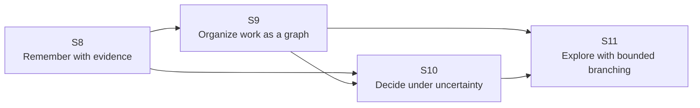

# MiniClaude Roadmap Preview: S8–S11

> **Last updated:** 2026-08-22
>
> S8–S11 是内部能力里程碑编号，不对应包版本号、固定 GitHub Release 或承诺日期。
> 各阶段范围会根据实现发现、评测结果和用户反馈调整。

MiniClaude 正在从以 Session 和 AgentLoop 为主要执行单元的本地 Agent runtime，
向一套“证据可追溯、任务可编排、关键决策可复核、探索过程可控”的
graph-native agent harness 演进。

## 路线主题

| 阶段 | 主题 | 用户价值 | 当前状态 |
|------|------|----------|----------|
| S8 | Evidence-backed Memory | 找回过去知道的内容，并能追溯证据 | Next |
| S9 | Graph Runtime | 把复杂任务组织成可执行、可观察的依赖图 | Planned |
| S10 | Critical Decisions | 只在关键决策上投入额外推理和恢复成本 | Research Preview |
| S11 | Bounded Exploration | 在受控预算内并行探索多条候选路线 | Future Research |

## 设计约束

- **Raw Evidence Ledger 是事实来源**：原始记录和 Decision 生命周期事件不可变追加；
  Decision Index 是可重建的派生视图，不是第二份真相。
- **Global Task Graph 与 Local Graph 共用同一 GraphRuntime**：Local GraphLoop 将是嵌套子图，
  不另造一套调度器。
- **默认有界**：节点数、分支数、并发度、token、时间和恢复次数都必须有硬上限。
- **能力经评测后才进入默认路径**：额外模型调用必须证明质量收益大于成本与延迟。
- **演进而非推倒重来**：现有 AgentLoop 将成为 Normal Node 的执行器，
  现有 Tool/Permission/MCP 管线继续复用。

本文统一使用 `Global Task Graph` 表示整体任务 DAG，`GraphRun` 表示它的一次执行实例，
`Local Graph` 表示 Explore Node 内的嵌套子图，`Subagent` 表示派生 Agent。

---

## S8 — Evidence-backed Memory & Context Recovery

**Status: Next**

### 目标

当新任务依赖历史决策时，Agent 能在受控 token 预算内找回相关 Decision 及其原始证据，
基于证据继续推理，并将新的重要结论以可追溯、可取代的形式沉淀。

### 计划范围

- 新增按 Session 隔离、不可变追加的 Raw Evidence Ledger；thread 压缩或重写不删除原始证据。
- 为 message、event、tool result 和 Subagent output 增加稳定证据 ID 与来源信息。
- 统一 `session_id`、`run_id`、`parent_run_id`，并为每个 Run 分配单调递增的 `event_seq`，
  保证排序与事件归属可验证。
- 将 `decision.proposed`、`decision.confirmed` 和 `decision.superseded` 记录为账本事件；
  基于这些事件构建带 evidence pointer 和 schema 版本的可重建 Decision Index。
- S8 v1 只检索当前 Session：先查廉价的 Decision header，再按需展开 Raw Evidence，
  不自动跨 Session 注入内容。
- 敏感 Tool Result 只在原权限允许且完成策略化脱敏后保存正文、建立索引或重新注入；
  检索不会提升原始权限。
- 在硬性 token 预算内构造可注入 AgentLoop 的 `ContextPack`。
- Run 完成后的 Decision Consolidation 可产生 `proposed`；用户确认后记录 `confirmed`，
  后续确认的新结论可记录对旧 Decision 的 `superseded` 关系。
- 建立 retrieval hit rate、irrelevant context rate、answer consistency、token 和延迟基线。

### 明确不包含

- Global Task Graph 或 Local GraphLoop。
- 生产路径中的双采样 Critic。
- 向量数据库、跨 Session 自动检索和跨项目全局记忆。
- 从 daemon 崩溃点恢复半截协程，或自动重放已中断工具。

### 公开演示

在不重新加载整段历史对话的情况下，后续任务能找回一条已确认决策，展开其原始证据，
保持新结论与历史约束一致，并在结论变更时保留完整取代链。

### 阶段门槛

- 所有可注入 Decision 的 evidence pointer 都可解析到 Raw Evidence Ledger 中的原始记录。
- Decision Index 可以完全由账本事件重建。
- 默认只注入当前 Session 中已确认、未被取代且权限仍允许的 Decision。
- 检索内容永不突破配置的 token 上限。
- 删除 Session 时，其 Evidence Ledger 和派生 Decision Index 作为同一数据边界被清理。
- 关闭 Memory 能力后，现有 AgentLoop 行为保持不变。

---

## S9 — Graph Runtime

**Status: Planned**

### 目标

将复杂工作表达为经过 Schema 校验的静态 Global Task Graph，由 Core 负责依赖调度、执行状态、
输出传递、取消和持久化，而不再仅依赖模型自己维护 checklist。

### 计划范围

- `GraphRun`、`GraphNode`、依赖边、输入引用与输出引用数据模型。
- 提交给 GraphRuntime 的初始 DAG 必须经过 Schema 校验、环检测和规模限制；
  它可以由调用方手写或由上游 Planner 生成。
- `pending → ready → running → succeeded/failed/cancelled/blocked/interrupted` 节点状态机。
- Normal Node 复用现有 AgentLoop、ToolRegistry、PermissionManager 和 MCP 能力。
- 有界并发、依赖解锁、失败传播和显式取消语义。
- Graph 快照与节点事件支持观察和审计；daemon 重启后，原活跃节点被标记为 `interrupted`。

### 明确不包含

- 执行期动态修改 Global Task Graph，或由 Planner 自动重规划。
- 嵌套 Local GraphLoop、分支剪枝或“最优解”判定。
- Critical Decision 的双采样与 Critic 管线。
- 无隔离的多写者并行修改同一工作区。
- daemon 重启后自动续跑半截节点，或自动重放已经完成的工具。

### 公开演示

一个包含并行节点、依赖 join 和失败分支的静态任务图可以完整执行；每个节点的状态、
上游输入、产出结果和终态原因都可通过事件与持久化记录追踪。

### 阶段门槛

- 非法环和超限图在任何节点执行前被拒绝。
- 一个节点只在所有必需依赖达到允许终态后进入 `ready`。
- 取消 GraphRun 会停止可取消子节点，并产生唯一可解释终态。
- 节点事件不串图，慢客户端不会拖慢 Graph 执行。
- 已完成节点的非幂等工具不会被自动重放。

---

## S10 — Critical Decision Nodes

**Status: Research Preview**

### 目标

仅对高影响、高不确定性或高历史依赖节点投入额外推理成本，并让最终决策能够追溯到
候选方案、Critic 判断、恢复上下文与原始证据。

### 计划范围

- Critical Node 产生两个有意多样化的候选方案或答案及其可公开理由，
  而不是简单重复同一 Prompt。
- 结构化 Critic 输出 `conflict`、`context_dependency`、`uncertainty` 与缺失证据 Query；
  这些值是路由信号，不被表述为已校准概率。
- 关键节点始终先进行廉价 Decision header 检索，Critic 只决定是否展开原始证据。
- 复用 S8 Context Recovery，将命中证据注入一次受控 Re-reason。
- 通过 Decision Consolidation 保存最终结论、理由、证据指针和取代关系。
- 为每个 Critical Node 强制模型调用数、token、时间和恢复次数上限。
- 对比单采样、仅检索、双采样 Critic 和完整 Recovery 四组基线。

### 明确不包含

- 让所有节点默认执行双采样。
- 递归 Context Recovery 或无上限 Re-reason。
- 未经校准就将 Critic 小数分当作真实概率。
- 未经评测就默认切换小模型 Critic。
- 保存或暴露模型的隐藏 chain-of-thought。

### 公开演示

一个依赖历史架构约束的关键决策节点同时产生两个候选方案；
Critic 识别冲突或高上下文依赖，
找回相关 Decision 与 Evidence，完成一次 Re-reason，最终产出可解释、可追溯的决策。

### 阶段门槛

- 在预定义评测集上，完整流程必须相比“仅检索”和“单采样”基线带来可测量收益。
- 质量收益、额外延迟与 token 成本必须一起报告。
- Critic 的路由信号必须有回归用例，不依赖单个手写阈值证明有效。
- 任何 Critical Node 都最多执行一次自动 Recovery 和一次 Re-reason。

---

## S11 — Explore Nodes & Local GraphLoop

**Status: Future Research**

### 目标

对开放、多解且需要试错的子任务，在可观察、可取消、可审计的预算内
展开多条探索路线，
裁剪低价值分支，并将最有证据支持的结果汇总回 Global Task Graph。

### 计划范围

- Explore Node 使用 S9 GraphRuntime 创建具有独立命名空间的嵌套子图。
- 支持在 Local Graph 内受控新增候选节点，所有 Graph Patch 都需要 Schema 校验和规模检查。
- 每条分支可创建自己的 Subagent，但继承统一的权限、工具、事件与取消语义。
- 节点可等待 Local Graph 内依赖完成，支持显式 join，不依赖轮询文本约定。
- 强制分支数、节点数、嵌套深度、并发度、token、耗时和工具副作用预算。
- 使用证据完整度、约束满足度和 Critic 结果进行剪枝与汇总，
  不宣称找到数学意义上的全局最优解。
- 将最终选择、被舍弃分支及其证据写入可观察事件，必要时沉淀为 Decision Memory。

### 明确不包含

- 无上限自我复制、无上限分支或无上限嵌套。
- 分布式多机 Worker 调度。
- 跨项目 Global Task Graph 和自动跨工作区合并。
- 在没有 worktree/sandbox 隔离时允许多个写分支静默修改同一目录。
- 对“最优解”作无评测支撑的强保证。

### 公开演示

面对一个存在多种合理架构方案的子任务，Explore Node 在固定分支和 token 预算中
建立多条探索路线，
剪掉违反约束或证据不足的分支，最终将选择、理由和原始证据汇总回父节点。

### 阶段门槛

- 任意子图都不能超出配置的分支、深度、并发和费用上限。
- 取消 Explore Node 会级联取消所有活跃子节点和待处理审批。
- 分支终态、剪枝理由和汇总依据在 replay 中可重建。
- Local Graph 与 Global Task Graph 使用同一节点状态机、事件模型和持久化约定。
- 启用探索后的质量收益必须与额外成本、延迟和副作用一起报告。

---

## 评测与发布原则

后续阶段不以“调用更多 Agent”或“产生更多节点”作为成功标准。
每项新能力都必须同时评估：

- 任务成功率与结果质量。
- 历史决策一致性与证据可追溯性。
- 模型调用数、token 和端到端延迟。
- 工具副作用、取消和失败恢复行为。
- 与上一阶段 baseline 的可重复对比。

路线图只公开能力目标、架构边界和评测门槛；实验性 Prompt、未校准阈值、
检索排序策略和非公开评测数据不构成对外交付承诺。

## 反馈

欢迎通过 [GitHub Issues](https://github.com/zmylol/MiniClaude/issues)
讨论使用场景、评测方法和范围取舍。
