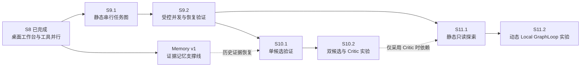

# MiniClaude Roadmap：S8 交付基线与 S9–S11

> **Last updated:** 2026-09-06
>
> S8–S11 是内部能力里程碑，不对应包版本号、固定发布日期或时间承诺。
> 本文以当前 `s8` 分支的交付为基线：**S8 桌面工作台与工具并行执行已完成**。
> 旧稿的「S8 = Evidence-backed Memory」与实际交付编号不一致，现将证据记忆单列为支撑工作，
> 保留 S9 Graph Runtime、S10 Critical Decisions、S11 Bounded Exploration 的方向。

接下来的目标是让已有桌面工作台承载可靠的多步骤任务，再验证额外检索、候选比较和探索是否值得投入。
先交付用户能看见、能停止、能核对结果的最小流程；每个阶段都保留不启用新能力的普通对话路径。

## 路线总览

| 阶段 | 用户能得到什么 | 交付顺序 | 状态 |
|------|----------------|----------|------|
| S8 — Desktop & Parallel Tools | 在桌面中管理项目、续聊、审批、停止任务和并行工具 | 作为后续基线维护 | **已完成** |
| S9 — Graph Runtime | 把清单变成真正按依赖执行、失败可解释的任务图 | S9.1 静态串行图 → S9.2 受控并发 | **下一主线** |
| 证据记忆支撑线 — Memory v1 | 找回已确认的项目决策，并查看未被压缩改写的原始证据 | 显式记录与检索 → 按预算注入；接入 S10 的历史恢复 | 计划中；当前 checkout 尚未实现 |
| S10 — Critical Decisions | 对明确标记的关键问题做验证，必要时才增加候选比较 | S10.1 单候选验证 → S10.2 双候选实验 | S9 后推进；增强策略按评测启用 |
| S11 — Bounded Exploration | 用有限、相互独立的候选路线解决开放问题 | S11.1 静态只读探索 → S11.2 按证据扩展 | 实验阶段；动态循环后置 |



**建议实施顺序：**先完成 S9.1 的纵向闭环，再做 S9.2；Memory v1 可并行设计，
但单人开发时不要同时展开两套运行时改造。S10.1 可先使用显式输入与确定性检查，
接入历史恢复前必须完成 Memory v1。S10.2 与 S11.1 按实际任务需求选择，互不作为全量前置。

## S8 — 已完成的交付基线

**Status: Complete — Desktop & Parallel Tools**

当前交付依据为 `s8` 分支提交 `3de7e67`（初版桌面端和工具并行执行），
详细操作与限制见 [桌面应用说明](docs/DESKTOP.md)。

| 已有能力 | 可复用实现 |
|----------|------------|
| 原生桌面窗口、项目切换、模型与权限设置 | [desktop/app.py](src/mini_claude/desktop/app.py)、[web/static/app.js](src/mini_claude/web/static/app.js) |
| 会话持久化、历史恢复、审批与停止入口 | [session/manager.py](src/mini_claude/core/session/manager.py)、[session/store.py](src/mini_claude/core/session/store.py) |
| 同一轮工具并发执行，结果按调用顺序回填 | [loop.py](src/mini_claude/core/loop.py)、[并行工具测试](tests/unit/test_parallel_tools.py) |
| Git 改动、PR、计划任务和 MCP 管理 | [桌面功能清单](docs/DESKTOP.md#可以直接操作的功能) |

S8 完成不表示旧稿中的不可变证据库、Decision Index、GraphRuntime 或 Critic 已经交付。
当前 `context.md`、`notes.md` 和压缩摘要是基础上下文能力；它们不等于带证据引用的长期记忆。
已有 `TaskManager.blocked_by` 是任务清单关系，不能直接视为图调度器。

**维护原则：**后续阶段不得破坏已有聊天、中文输入、并行工具、审批、停止、项目切换和重启续聊流程。
桌面端继续作为这些能力的主操作入口，不再为 S9 另建一套独立客户端。

## 后续阶段共用的工程契约

以下是交付新能力时需要核验或补齐的契约，**不是已实现模块的声明**。
`GraphRuntime`、`RunSupervisor`、`MutationCoordinator` 等名称是设计角色；优先围绕现有
[AgentRunner](src/mini_claude/core/runner.py)、Session、Tool/Permission/MCP 管线实现最小适配。

- **执行有唯一 owner。** 每次节点执行都有 `run_id`、父级身份、取消路径和唯一终态；
  不在图调度器内另起无法回收的后台 Agent。
- **节点上下文独立。** GraphRun 属于一个项目与父 Session，节点使用独立执行上下文，
  通过明确的输入和产物引用通信，不并发修改父 Session 的 thread。
- **权限不能因派生而扩大。** Node、Subagent、检索和探索分支继承 Workspace 与原数据可见范围；
  未知 MCP、Bash 或可派生写入子任务的节点都按可能产生副作用处理。
- **并发与工具并行分开治理。** S8 的同轮工具并发不代表两个 Graph Node 能安全地同时修改项目。
  mutation-capable Run tree 在 Workspace 级互斥；树内的 mutation Node attempt 也必须串行。
  父子复用 lease 只解决所有权，不能给兄弟节点并行写授权。
- **恢复事实，不重放副作用。** 重启后保留已完成产物和事件，将未完成运行收口为 `interrupted`；
  不自动恢复半截协程、审批 future 或已可能执行过的工具。
- **默认有界。** 节点数、并发、模型调用、token、时间和持久化容量在启动前有明确上限；
  超限后停止派发新工作、收尾已启动资源，并报告未完成部分。
- **模型输出是待验证数据。** Planner 输出、证据正文和 Critic 建议不能修改权限、预算或运行事实；
  只保存可公开的理由、检查结果和证据，不保存隐藏 chain-of-thought。

旧 Pre-S8 草案中的问题按当前代码重新核对：仍存在且会影响本阶段正确性的缺口，纳入对应增量先修；
已修复项以回归验证复用，不按旧编号重新开发。历史审计不作为当前漏洞清单。

## S9 — Graph Runtime

**Status: Next**

**Depends on:** S8 现有执行能力，以及本阶段实际使用的 Run、Workspace、取消与持久化契约。
Memory v1 不是静态图调度的技术前置。

### S9.1：先交付一个可解释的静态串行图

**用户场景：**提交「阅读项目 → 提出修改 → 执行修改 → 验证」的明确任务图，
在桌面中查看当前步骤、输入、结果与失败原因，并能一次停止整张图。

最小范围：

1. 定义版本化 `GraphSpec`、`GraphRun`、`NodeSpec`、required dependency 与产物引用。
   V1 由调用方提交静态图；执行前检查环、重复 ID、缺失引用、输出绑定与规模限制。
2. 每个 Normal Node attempt 复用 AgentRunner/AgentLoop，并登记 `graph_run_id`、`node_id`、`attempt`
   与对应 Run。先串行调度；不自动生成计划、不自动重试、不执行期改图。
3. 节点状态为 `pending → ready → running → succeeded/failed/cancelled/interrupted`，
   无法满足依赖的节点为 `blocked`。仅全部 required dependency 成功才可运行；失败只阻塞相关下游，
   独立分支仍可按顺序完成。V1 无 optional node 或条件边。
4. 上游只通过声明的、带来源的产物引用向下游传值；节点完成时验证产物是否存在且满足输出契约，
   不把模型说「已完成」直接当作成功。节点上下文使用提交时确定的父上下文，不共享可变对话列表。
5. 图提交使用持久化 `request_id → graph_run_id` 幂等映射，重复请求不能启动第二张图。
   追加保存图事件及单调 `graph_event_seq`；snapshot 是可重建投影。图中每个 Node attempt 可定位到 Run 记录。
6. 桌面先提供节点列表、依赖、状态、产物和错误详情；继续使用既有审批与停止入口。
   拓扑画布、拖拽编辑和可视化编排器不进入首版。

**修改前置：**S9.1 即需让 GraphRun、普通对话和 Subagent 共用最小 Workspace 协调，
并发 Root 之间不能发生未隔离的读写冲突；图内串行不能替代这一边界。
父 Session 的一次 root turn 管理整张图，派生节点使用独立上下文，不通过新的父 Session user turn 抢占 lease。
这些契约未通过回归前只能演示只读图，不能开放修改节点或将 S9.1 标为完成。

**终态规则：**全部节点成功则图成功；节点失败且其余独立分支已结束则图失败；用户取消停止派发并级联收尾；
重启遗留图收口为 `interrupted`。由单一终态提交路径处理完成、取消和持久化失败的竞争，
不得先向用户报告成功再发现结果未落盘。

**验收：**使用可控的模拟 Node executor 验证线性图、diamond join、失败分支、取消与重复提交；
非法图在任何工具执行前拒绝；重启或删除 snapshot 后可恢复执行事实，且不再次运行已完成工具。
并发提交普通对话与图任务时，Workspace 冲突和父 Session 忙碌都得到确定处理，审批仍可响应。
最后用一个真实项目任务验证桌面完整闭环。可靠日志和重启收口是 S9.1 的基础，不延后到开启并发之后。

### S9.2：再开放受控并发

仅对完整 capability closure 可证明 read-only 的节点开放并行；包含写入、Bash、unknown MCP
或可派生 mutation child 的 attempt 都不能被工具名称表面判断成只读。
mutation-capable Root tree 使用 Workspace 独占 lease，其他 Root 的修改请求得到明确 `WORKSPACE_BUSY`；
图内部尚未获得调度资源的节点继续留在 `ready`，不误报为工具失败，也不做忙轮询。
独占修改期间，不允许其他 Run 在同一可变工作树并行读取；树内共享同一工作树的读写节点也不重叠，
避免只读节点观察到一半的修改。只有获得显式稳定快照的读取才能例外。

在 S9.1 已建立的跨 GraphRun、普通对话和 Subagent 协调上开放只读并发，
验证并行审批、分支取消、慢客户端与日志重建。
需要全新工具调用的人工重跑应创建明确的新执行，不复用已经发生副作用的旧 attempt。

**验收：**至少两个独立只读分支确实重叠执行，join 只在上游全部成功后启动；
任何未隔离的读写冲突都不能越过 Workspace/树内协调。取消完成后没有活跃子节点、待处理审批或遗留 lease；
随机事件交错与重启后仍保持唯一终态、正确事件归属和无自动重放。

**S9 暂不包含：**自动 Planner、自动重规划、自动失败重试、跨进程分布式 Worker、动态嵌套子图、
无隔离的多写者、恢复半截节点，以及图形化编辑器。

## 证据记忆支撑线 — Memory v1

**Status: Planned；承接旧稿的 Evidence-backed Memory，不作为另一轮 S8。**

**目标：**在当前 Session 中明确保存一项决策，压缩或重启后仍能以有限 token 找回其原始证据。
先支持显式记录和检索，再考虑自动归纳、排序优化或跨 Session 能力。

首版交付：

- 为纳入记忆的原始 message、tool result、artifact 建立稳定证据 ID、来源、hash 和 schema 版本。
  需要保留的正文在产生时写入 Session-owned Immutable Content Store，不能在 compaction 后用摘要冒充原文；
  已有记录若缺原文，明确报告不可恢复，不补造证据。
- Raw Evidence Ledger 追加记录证据准入及 `decision.proposed/confirmed/superseded` 生命周期；
  Decision Index 是可删除后重建的查询投影。显式保存先走用户确认，模型归纳只能产生 proposed。
- 查询只在当前 Session 内进行：先返回廉价 Decision header，再按需展开证据。
  默认只注入已确认、未被取代、原权限仍允许的结论；敏感正文遵循原数据策略，不因检索提升权限。
- 使用硬性 token 上限构造 `ContextPack`，保留证据引用、缺失信息和截断说明，
  从 Runner 的上下文组装入口接入。无命中、证据损坏或预算不足时显式降级，不伪装成已恢复完整上下文。
- 在桌面中提供决策查看、确认、取代和查看证据的最小入口，复用现有页面模式。
- Session 删除一并清理 content、ledger 和索引；配置磁盘配额，达到上限时报告 `evidence_capacity_exceeded`，
  停止接受新的证据正文，不静默驱逐已确认决策引用的内容。

**验收：**证据引用在 compaction、重启与索引重建后仍可解析且 hash 一致；
被取代或无权访问的内容不再默认注入；token/磁盘均不超限，写入失败不留下已确认的悬空引用。
关闭 Memory 后普通对话仍可用。保存一组「历史约束 → 后续问题 → 原始证据」用例，
记录检索命中、无关上下文比例、答案一致性、token 和延迟，作为 S10 的基线。

**后置：**自动 Decision Consolidation、向量数据库、自动跨 Session/跨项目检索、全局记忆和复杂排名策略。
这条支撑线完成前，S10 可以交付不依赖历史恢复的验证流程，但不能宣称具备 evidence-backed recovery。

## S10 — Critical Decisions

**Status: Planned core / Experimental enhancement**

**Depends on:** S9 的节点执行、产物与预算契约；涉及历史证据时额外依赖 Memory v1。

### S10.1：显式关键节点 + 单候选验证

用户或调用方显式将高影响、有实际歧义的节点标为 critical；先不让模型自动决定所有路由。
节点输出结构化结论、可公开理由、假设、证据引用与待确认项，并通过可执行测试或约束检查验证。
历史依赖节点先查 Decision header，只有确需原文时才按预算展开证据。

验证优先使用类型、构建、测试、约束和来源检查。候选生成与评审不直接执行项目修改或外部写入；
修改由后续普通 Node 走原审批链路。证据不足或约束冲突时标记需要人工决策，不能把模型置信措辞当作验证成功。

**验收：**桌面可查看结论、验证结果和证据；测试失败或证据不足时不会误报可执行，
取消与预算限制沿用普通 Node。建立「单候选」与「单候选 + 检索/验证」两条可复现基线。

### S10.2：有收益才增加第二候选与 Critic

只对单候选基线确有错误、确定性检查无法直接区分方案、且影响足够高的任务开启实验。
从相同约束和证据输入生成两个有意多样化的候选；Critic 输出结构化冲突、缺失证据 Query
和不确定性理由，这些是路由信号，不是已校准概率。

首版增强路径最多包含两次候选生成、一次 Critic、一次自动 Recovery 和一次 Re-reason；
总计最多四次决策模型调用，检索不得隐含额外 LLM 调用。预算需预留到整个路径，
不得为每个子步骤重新发一份额度。任一调用失败、输出无效或预算不足，返回仍可验证的较简单结果；
没有可验证结果时要求人工处理，不能静默选择失败候选或无限重试。

最终决策写为 `proposed`；只有用户或明确授权的外部流程可确认。现有已确认约束不能因 Critic 更偏好新答案而被自动取代。

**评测门槛：**在冻结任务集上比较单候选、单候选 + 检索/验证、双候选 + Critic、完整 Recovery 四组。
增强策略必须相对**最便宜且有效的基线**证明增量收益，不能只选择最弱基线作为对照。
质量提升达到预先记录的最低值，额外 token 与 p95 延迟不超过上限；同时报告失败率、路由覆盖率
和未触发路径成本。未过门槛就继续使用 S10.1，不阻塞普通图执行或 S11 的静态探索实验。

**S10 暂不包含：**所有节点双采样、自动关键性分类器、递归 Recovery、无上限 Re-reason、
未经评测的廉价 Critic 替换，以及隐藏 chain-of-thought 的持久化。

## S11 — Bounded Exploration

**Status: Experimental；先证明静态探索有用，再考虑动态循环。**

**Depends on:** S9 的执行、并发、产物和预算契约。
只有使用 S10 Critic 做剪枝时才依赖其已验证策略；确定性检查或人工选择无需等待完整 S10.2。

### S11.1：固定、只读、单层的候选探索

首版在开始前声明有限候选路线，编译为同一 GraphRuntime 的静态子图，
执行独立只读研究后显式 join。固定分支总数、并发数、总 token、时间和工具调用额度；
全部分支由父级统一预留、扣减和回收预算，超时或取消停止整棵执行树。

各分支使用相同输入快照和独立上下文，不读取另一条分支尚未定稿的结果。
首版不修改项目文件，不执行网络发布等外部副作用；逐条串行修改同一目录也不算候选隔离。
汇总依据是约束满足、验证结果、证据和明确选择标准；若没有合格候选，结果就是「暂无可执行方案」。

桌面先展示路线、状态、已用预算、产物以及保留/淘汰理由，复用 S9 节点列表。
选择结果传回父节点，由后续普通 Node 决定是否执行修改。证据需写入长期记忆时，遵守 Memory v1 的权限和确认流程。

**验收：**用固定输入比较单路线、相同总预算的单路线增强与多路线探索；
不能仅靠更大总预算宣称架构收益。各分支无上下文或工作区污染，未选路线可追溯；
取消完成后无活跃分支或待审批，不再派发新调用；在途请求的费用继续结算并记录，只释放未使用的预留预算。
质量收益、成本和延迟同时满足预注册门槛。

### S11.2：动态 Local GraphLoop 是条件性后续

只有 S11.1 已证明价值，且失败样本表明确实需要运行时新增依赖/候选，才进入这一增量。
复用同一 GraphRuntime 的状态、日志和取消模型，不另造 Local 调度器。

- Graph Patch 带幂等 ID；提交前验证合并后的整张图、全部引用与预算，原子接受或整体拒绝。
  不修改已启动节点的输入、依赖和身份，不使全局图出现环。
- 子图有独立命名空间，继承父级权限和剩余预算；限制总节点、分支、嵌套深度与并发。
  父节点等待 join 时不占用子节点必须取得的执行槽，避免嵌套死锁。
- 剪枝先停止派发，再取消并等待活跃工作；所有已发生调用继续计费和记录，不能靠淘汰分支抹去成本。
- Replay 只重建 Patch、分支状态和选择依据，不自动重做工具。执行期 Patch 不能修改父节点的权限或预算。

**单独后置写探索：**若未来需要候选分支实际改代码，先交付隔离工作区、测试环境、
外部副作用约束和显式合并策略。Git worktree 仅隔离文件，不隔离网络、数据库或发布动作。
这不属于 S11.1 的完成条件，也不随动态 GraphLoop 自动开放。

**S11 暂不包含：**无限分支/嵌套、分布式多机调度、跨项目自动合并、共享目录多写者，
以及对「全局最优解」的保证。

## 统一验收与推进规则

| 维度 | 记录内容 | 推进条件 |
|------|----------|----------|
| 正确性 | 依赖、终态、幂等、审批、取消、重启与事件归属 | 确定性回归通过；关键不变量不以平均分抵消 |
| 任务质量 | 任务成功率、约束满足、证据一致性；含失败与超时样本 | 相对有效基线达到预先设定的质量提升下限 |
| 成本与延迟 | 总模型调用、总 token、工具耗时、端到端 p50/p95 | 额外成本与延迟不超过预先设定的上限 |
| 隔离 | Workspace、Session、并行上下文、敏感证据和外部副作用 | 负向用例通过，无自动权限扩大或副作用重放 |
| 用户闭环 | 桌面可提交、观察、审批、停止、查看结果和解释失败 | 至少一个真实任务完成端到端演示 |

每个实验开始前，在对应评测记录中冻结任务集、基线、样本数/重复次数、随机性控制、质量下限和成本上限；
数值是实验配置，本文不把未测量的阈值包装成结果。报告波动范围，不能凭单次 Demo 宣布通过。
模型更换、工具权限变化或关键提示调整后，重新验证对应结论。

S9 以执行正确性和可操作性为主；S10.2、S11 额外要求可重复的质量/成本收益。
实验失败时保留较简单的可用路径。新能力先显式启用，达到门槛后才讨论默认开启，
不以更多 Agent、更多调用或更多节点作为进度。

## 下一步实施清单

1. **核验 S9.1 需要的最小底座。** 列出现有 Runner、Session、审批、取消、事件与持久化接口；
   用行为回归确认可复用项，剩余正确性缺口进入 S9.1，避免先做无关的大规模重构。
2. **先固定协议与结果契约。** 为静态图、节点输入/输出、幂等提交和终态规则准备有效/无效样例，
   使用模拟 executor 验证，不以真实模型输出稳定性替代调度正确性。
3. **完成一次纵向交付。** 串行调度 → 既有 Runner → 事件持久化 → 桌面节点列表 → 审批/取消 → 重启收口。
   这一闭环通过后再开放 S9.2 并发。
4. **保存评测基线。** 以 S8 普通聊天和 S9 静态图作为对照，再根据历史约束类失败样本推进 Memory v1/S10；
   根据多解任务失败样本决定是否投资 S11。

## 附录：Pre-S8 历史稳定化草案

以下保留 2026-08-23 的审计与设计原文，供核对设计理由和未解决项。
其中的状态、风险判断、模块名称和「进入 S8 的门槛」均属于**历史草案语境**，
不覆盖上文的当前交付状态，也不表示所有问题在当前代码中仍然存在。
后续实现应按本阶段实际依赖选取并验证，不将整份历史草案重新设为 S9 的整体前置。

<details>
<summary>展开历史审计、Immediate Gate 与 S7.1–S7.4 设计</summary>

## 数据权威边界

以下是各 pre-S8/S8 阶段完成后的目标状态，不要求当前实现已经具备：

| 记录 | 权威范围 | 非权威用途 |
|------|----------|------------|
| Session turn acceptance journal | 用户轮次是否被接受、canonical user payload、`request_id → run_id` 幂等映射 | 不承担运行事件排序 |
| Session thread | 可被 compaction 重写的 Provider 对话投影；user row 可由 turn journal 重建 | 不能作为长期 evidence payload authority |
| Session-owned Immutable Content Store | S8 纳入证据的原始 message/model/tool/artifact content blob，以 `content_id`/hash 寻址 | 不承担 Decision 生命周期或运行排序 |
| Exact Run event log | 单个 Run 的执行顺序、审批、tool intent/outcome、状态变化和唯一 canonical terminal | IPC 投递副本不是事实来源 |
| GraphRun event log | S9 中的调度决定、节点状态转移和 `graph_event_seq` | Graph snapshot/metadata 只是投影 |
| Raw Evidence Ledger | 哪些 immutable content / exact event 被纳入证据、其 pointer/hash、Decision 生命周期 | 不复制出另一份可独立修改的事实 |
| Session/Run metadata、replay offset、Decision Index | 快速查询和恢复用派生摘要/索引 | 损坏时必须从对应权威记录重建 |
| daemon trace/log | 调试和性能诊断 | 不用于判断工具是否执行或恢复业务状态 |

## Pre-S8 风险归位

以下优先级是 2026-08-23 本地审计快照：P0 表示可能突破数据/权限边界、重复副作用或损坏执行事实，
P1 表示显著可靠性与发布风险，P2 表示维护性风险。

| 已确认风险 | 优先级 | 归属计划 |
|------------|--------|----------|
| 文件工具接受绝对路径和 symlink 逃逸；未认证 TCP 可调用全部 RPC | P0 | Immediate containment + S7.2 |
| 并发 Run 共享 EventBus writer、订阅不释放、后台任务没有统一 owner | P0/P1 | S7.1 + S7.4 |
| Skill 有效提示未进入真实 LLM 输入；auto-compaction 可丢消息 | P0 | Immediate Gate |
| 普通 runtime error 会重试副作用工具；流重试可让 UI 与最终答案不一致 | P0 | Immediate Gate |
| 无 API key 时 daemon 无法按文档约定提供 ping/管理能力 | P1 | Immediate Gate |
| Session 已落盘但重启不加载；覆盖写入和坏行处理缺少恢复契约 | P1 | S7.3 |
| clean checkout 无法 frozen sync；测试/lint 不全绿；协议生成器漏模型 | P1 | S7.4 |
| TUI 单文件过大、Root/Subagent 装配重复 | P2 | S7.1 统一装配；S7.4 非阻断拆分 |

---

## Immediate Gate — Safety & Correctness Hotfixes

**Status: Draft / Immediate**

### 目标

在改变 Run、Workspace 或持久化架构之前，先用最小改动修复已经能够复现的安全和正确性缺陷，
建立可信的回归基线。该 Gate 只做 containment 与行为修复，不借机重写 AgentLoop、Skill、
Compaction 或 Permission 架构。

### 计划范围

- **[P0] 临时文件边界**：在 S7.2 的显式 Workspace 模型落地前，以 daemon 启动时捕获的
  canonical root 作为临时边界。`read_file`、`write_file`、`list_dir` 必须在 I/O 前拒绝 absolute、
  `..`、symlink final target 和 symlink ancestor 逃逸；Root 与 Subagent 不得存在旁路。
- **[P0] 临时传输收口**：无认证机制时只允许数字 loopback bind；配置为 `0.0.0.0`、`::`、
  LAN 地址或其他非 loopback 地址必须在创建 socket 前失败。完整握手和客户端授权进入 S7.2。
- **[P0] Skill 注入修复**：rendered prompt 必须真正进入 Provider 可见输入，`$ARGUMENTS` 不得残留，
  参数不得重复注入；原始 slash command 可以继续用于 UI/审计，tool whitelist 语义保持不变。
- **[P0] Auto-compaction 持久化修复**：移除以压缩前 `prefill_len` 切片作为提交边界的做法。
  压缩成功后，thread 必须形成一致的 compacted base 加后续输出；失败时保持原历史不变。
- **[P0] Tool retry 副作用修复**：普通 `runtime_error` 默认不重试；只有显式 transient 类型且
  工具契约声明可安全重放时才允许有限重试。一次审批不能让 Bash 或其他副作用工具执行多次。
- **[P0] LLM stream retry 修复**：已向客户端发布 partial token 后不能静默换成另一轮未发布的结果。
  Hotfix 可以选择“首 token 后不重试”、显式 reset event 或 attempt buffer，但成功 Run 的可见 token
  拼接结果必须与最终 `LlmResponse.text` 一致。
- **[P1] 无 API key 启动**：daemon、`core.ping` 和不需要模型的管理命令必须能够启动；
  真正发起 Agent/Compaction 时才返回结构化配置错误，并保证不会留下 ghost Run。
- 将 compactor 测试改为 pytest async 风格，先写上述缺陷的失败回归，再做最小实现修复。

### S7.1 合入前工程前置

以下事项不是产品 hotfix，但必须在引入新 Run/IPC 协议前建立，避免在红色基线上继续扩张：

- 跟踪 `uv.lock`，使 clean checkout 的 `uv sync --frozen` 和 `uv lock --check` 可通过。
- 修清现有 Ruff 与 unit failure；不通过扩大 ignore 或跳过 compactor tests 获得绿色结果。
- 将真实 Anthropic/MCP E2E 标为显式 `live`，默认验证不读取开发者 `.env`、不产生外部费用。
- 让协议生成器覆盖全部 `Command` / `Event` union member，并增加 exhaustiveness test；
  `--check` 不能只证明文档与一个不完整的硬编码列表一致。
- S7.4 负责把这些结果固化进 CI、release smoke 和持续维护，不重复承担首次修复责任。

### 明确不包含

- `RunSupervisor`、父子取消或事件订阅重构；这些属于 S7.1。
- Workspace identity、token handshake、controller/observer 授权或持久权限迁移；这些属于 S7.2。
- Session 重启加载、原子状态文件和 interrupted 恢复；这些属于 S7.3。
- 新 Skill DSL、新压缩算法、通用 retry framework 或 shell sandbox。
- 与已确认缺陷无关的格式整理和模块拆分。

### 公开演示

在无 API key 的干净环境启动 daemon 并完成 ping。随后用测试 Provider 执行带参数 Skill、
触发多轮 Session 的 auto-compaction，并模拟 tool runtime error 与 partial LLM stream failure：
实际 LLM 输入包含正确 Skill 参数，下一轮历史不丢消息，副作用工具只执行一次，
客户端可见文本与最终结果一致。

同时尝试读取绝对路径、读取 Workspace 外 symlink 和通过 symlink parent 写文件，
外部 sentinel 均保持不变；尝试非 loopback bind 时 daemon 在监听前明确失败。

### 阶段门槛

- 文件工具的 absolute、`..`、symlink file、symlink directory 和不存在 write target 逃逸测试全拒绝。
- SessionManager → Runner → Provider 边界测试证明有参/无参 Skill 的 rendered prompt 真正生效，
  未知 Skill 和普通多轮消息行为不变。
- 首轮、多轮、压缩后 tool call、最终回答与 compaction failure 回滚均不丢失或重复消息，
  Anthropic role/tool pairing 保持合法。
- 副作用工具在“执行后返回错误”场景调用次数为 1；显式 rate-limit 路径仍只执行配置上限内的重试。
- partial stream failure、成功重试、重试耗尽和取消测试具有唯一、可解释且一致的输出。
- 无 `ANTHROPIC_API_KEY` 的集成测试可启动 daemon 并 ping；Agent 请求返回结构化错误或明确终态。
- 相关 targeted tests、全部 unit tests 和不访问真实外部服务的 integration tests 通过。
- clean checkout frozen sync、Ruff、mypy、协议 exhaustiveness 与生成文档检查通过。

### 建议实施顺序

1. 修复 async test harness，并为每个已确认缺陷建立最小失败回归。
2. 先完成路径逃逸和非 loopback bind containment，降低继续开发期间的暴露面。
3. 修复 Tool/LLM retry 语义，确保不会重复副作用或产生双份事实。
4. 修复 Skill 注入和 auto-compaction 持久化。
5. 延迟 Provider 初始化，补无 key daemon/ping 测试并运行完整非 live 回归。
6. 跟踪 lockfile、清 Ruff、拆分 live tests，并修复协议 source-of-truth，形成 S7.1 合入基线。

---

## S7.1 — Run Boundary & Cancellation

**Status: Draft / Pre-S8 Gate**

**Depends on:** Immediate Gate

### 目标

让 Core 对一次 Agent 执行拥有唯一、明确且可验证的生命周期所有权。无论执行来自一次性请求、
Session 对话还是 Subagent，都能立即获得稳定 `run_id`，被独立观察或级联取消，并且最终只产生
一个可解释终态；一个 Run 的事件、审批和失败不会泄漏到其他 Run。

### 核心设计决策

- 新增 daemon-scoped `RunSupervisor`，作为 Agent run tree 的唯一所有者；它负责注册、启动、
  查询内部状态、取消、收尾和 daemon shutdown 时的回收。
- `RunSupervisor` 只管理 Agent run tree，不在 S7.1 中扩张为 Socket、MCP、trace 等所有后台资源的
  通用 supervisor；`AgentLoop` 继续作为单个 Run 的执行器。
- 每个 `RunHandle` 至少记录 `run_id`、`session_id`、`parent_run_id`、该 Run 自身的
  `execution_task`、子 Run、
  当前状态和终态结果。SessionManager 保存对话状态，但不再拥有运行任务。
- 每个 Session 同时只允许一个 active Root Run。`session.send_message` 必须与 Run 注册原子地取得
  Session turn lease 并设置 `active_run_id`；lease 一直持有到整棵 Run tree 终结且本轮 thread 提交完成。
  lease 存在时，新的 send/compact/close 返回带当前 `active_run_id` 的结构化 `SESSION_BUSY`；
  permission response 仍允许通过。S7.3 的 delete 同样拒绝 active Session，S7.1 不实现隐式排队。
- AgentLoop/Runner 返回 provisional execution outcome，RunSupervisor 的 Session finalizer 才拥有
  terminal authority。对 Session Run，finalizer 必须先关闭 descendants、提交本轮新增 thread/artifact，
  再写 canonical terminal 并释放 turn lease；持久化失败不能先发布 success，必须收口为明确的
  `failed/persistence_error` 或可由 S7.3 reconciler 修复的状态。
- 最小状态机为 `running → succeeded | failed` 或
  `running → cancelling → cancelled`。终态不可逆，完成与取消竞争必须通过同一原子收口路径，
  并且只发布一次 terminal event。
- `run.cancel` 的同步响应只表示取消请求是否被接受以及当时观察到的状态；
  `run.finished` 才是最终结果的权威来源。内部 `succeeded` 在公开事件中继续映射为
  `status=success`，并将公开状态枚举扩展为 `success | failed | cancelled`；取消不能伪装成普通失败。
- `run.cancel` 结果使用 `{accepted, state}`：从 `running` 发起时原子切换为
  `{true, cancelling}`；已是 `cancelling` 或 `cancelled` 时返回 `{true, current_state}`；
  已是 `succeeded` 或 `failed` 时返回 `{false, current_state}`；未知 `run_id` 返回 `{false, null}`。
- 新增只读 `run.get`，返回当前 state、已知 outcome 和 identity metadata；它不替代事件流，
  但允许客户端在 live IPC 断连后查询当前进程内的权威状态。S7.3 再使该查询跨重启可用。
- Root Run 与派生 Subagent 组成显式父子树。取消父 Run 会级联取消仍在运行的子 Run 和待处理审批；
  子 Run 结束不会反向取消父 Run。
- 父 Run 无论成功、失败还是取消，都不能在仍有活跃 descendant 时进入 terminal：先关闭 child 注册，
  对仍活跃 child 发出取消并逐一 await，再按 child → parent 顺序写 terminal。正常完成的 child 可被 join；
  被父级遗留的 child 必须收拢，one-shot Session 不能先于整棵树关闭。
- Child 注册与父级取消必须经过同一同步边界。父 Run 不再是 `running` 时拒绝注册新 child，
  且不得先创建未受管 task 再补登记，避免取消快照之后漏出新的 Subagent。
- 每个 Run 拥有独立 event stream 和 `events.jsonl`。需要全局观察时，由有生命周期的 bridge
  转发事件；terminal event 必须先持久化和发布，之后才能解除 bridge 和 writer。
  不能让每个 writer 永久订阅共享 EventBus。
- “唯一 terminal”只承诺 canonical exact Run log 中有且仅有一条。Live IPC 在单连接内按序投递，
  但断连、背压和 replay 可能造成客户端缺失或重复观察；客户端按 `(run_id, event_seq)` 去重，
  S7.1 可用 `run.get` 查终态，S7.3 再提供 durable replay-to-live 修复缺口。
- 所有运行事件至少携带 `session_id`、`run_id`、`parent_run_id` 和 Run 内单调递增的
  `event_seq`。`agent.run` 延续现有行为，为每次请求创建内部 one-shot Session，因此
  `session_id` 必填；它是身份和数据清理边界，不是可恢复的 chat Session，并在 Root Run 终态后关闭。
  其落盘数据与普通 Session 使用相同的保留/删除边界，但 S7.1 不新增重启加载或自动清理策略。
  Root Run 的 `parent_run_id` 明确为 `null`，其余字段不得用空字符串代替缺失值。
- Run 文件只持久化 exact Run 事件。IPC scope 明确区分 `run:<run_id>`（仅当前 Run）、
  `run-tree:<root_run_id>`（Root 及其 descendants）和 `session:<session_id>`（Session 内所有 Run）；
  聚合只发生在投递层，不能反向写入单 Run 日志。客户端 fan-out 使用有界队列，并定义可观测的
  溢出或断连行为。
- S7.1 同时建立最小 `CoreLifecycle` / `ConnectionRuntime` 骨架，只负责 connection handler、
  sender queue、subscription 和 RunSupervisor 的创建/关闭关系；MCP、trace、store 等组件的全面
  故障传播和 shutdown hardening 留给 S7.4，避免前三阶段各写一套临时 task ownership。

### 计划范围

- 引入 `RunSupervisor`、`RunHandle`、Run 状态与唯一终态收口逻辑。
- 引入 Session turn lease / `active_run_id`，固定同 Session 单 Root Run 和 busy command 行为。
- 让一次性请求、`session.send_message` 和 Subagent 通过同一条 Run 启动路径执行。
- `session.send_message` 在 Run 注册并启动后立即返回 `run_id`，不等待整轮模型调用结束；
  后续输出和终态通过事件观察。
- 将权限等待项按 `run_id` 建立索引；取消 Run 时，相关审批 future 必须被确定性解决和清理。
- 将 Subagent 注册为父 Run 的 child，统一继承取消、事件元数据和收尾规则。
- 为每个 Run 建立隔离的事件写入路径，并为 IPC 订阅补齐显式订阅/退订和背压边界。
- 增加 `run.get`，并用最小 ConnectionRuntime 追踪 connection handler/sender task 与订阅清理。
- daemon shutdown 时拒绝新 Run，取消或收拢全部受管 Run，清理审批和事件订阅后再退出。
- 补齐 CLI/TUI 的取消反馈、协议文档、单元测试、竞争条件测试和多 Run 集成测试。

### 明确不包含

- MCP、trace、store 等全部 daemon components 的故障传播、health 和 shutdown hardening；
  S7.1 只建立连接与 Run 所需的最小 lifecycle 骨架，完整范围进入 S7.4。
- 工作区身份模型、文件工具路径隔离、symlink 防逃逸、RPC 认证和非 loopback 暴露策略；
  除 Immediate Gate 的临时 containment 外，完整方案进入 S7.2。
- Session 重启加载、Run 跨进程恢复、SQLite、迁移框架或非幂等工具自动重放；
  可恢复的持久状态进入 S7.3，自动重放继续明确禁止。
- S8 Memory、S9 GraphRuntime，或 TUI 的大规模结构重写。
- 与 Run 边界无关的已知正确性缺陷。Skill 渲染注入、auto-compaction 持久化切片和
  retry 异常路径必须通过 Immediate Gate，不随 S7.1 实现一起重构。

### 公开演示

同时启动两个 Run。Run A 派生一个 Subagent 并停在权限审批；用户取消 Run A 后，
父 Run 和 Subagent 各自产生且仅产生一个 `cancelled` 终态，审批 future 被解决并清理；
Session 随后仍可继续使用。Run B 不受影响并正常完成；
两个 `events.jsonl` 各自只包含所属 Run 的事件，慢速或断开的观察客户端不会拖慢执行。

### 阶段门槛

- 两个并发 Run 的事件文件零串流；每个 Run 的 `event_seq` 单调递增且无重复。
- 取消 Root Run 后，不残留受管 child task、权限 future 或 Run-local event subscription。
- 父 Run 成功、失败或取消时都不残留 descendant；canonical log 按 child → parent 各有一个 terminal。
- 注入 thread/artifact write failure 时，不会先发布 success；turn lease 只在可解释 terminal/恢复状态后释放。
- 完成与取消并发发生时，canonical log 只能包含一个 terminal event 和一个不可逆终态。
- 同一 Session 的两个 concurrent send 只有一个取得 turn lease；另一个确定返回 `SESSION_BUSY`，
  compact/close 也不能与 active Root Run 并发改写 thread 或 metadata。
- 对未知、已完成、正在取消和已取消的 Run 重复调用 `run.cancel`，返回值确定且操作幂等。
- `session.send_message` 在 Run 完成前返回 `run_id`，且此后仍能正常完成权限审批交互。
- 一个慢速或断开的 IPC client 不会阻塞 Run，也不会影响其他客户端接收事件。
- daemon shutdown 完成后，不存在仍存活的 supervised Run task。
- exact Run 订阅不能收到 sibling 事件；run-tree 与 Session 聚合订阅只覆盖其声明的边界。
- Live IPC 重复/断连后，客户端可按 `event_seq` 去重并通过 `run.get` 获得当前状态；
  文档不承诺网络 exactly-once delivery。
- 现有 AgentLoop、ToolRegistry、PermissionManager 和 MCP 主路径的回归测试保持通过。

### 建议实施顺序

1. **契约与竞争语义**：先定义 Run 状态、取消响应和 terminal event，并用测试固定
   completion-vs-cancel、重复取消和未知 Run 行为。
2. **统一所有权**：实现 `RunSupervisor`，让一次性请求和 Session Run 统一注册；验证
   turn lease、`session.send_message` 提前返回、busy 行为和 `run.get`。
3. **子树与审批清理**：接入 Subagent 和 PermissionManager；验证父级任意终态后无遗留任务或 future。
4. **事件隔离与背压**：切换到 Run-local writer、显式 bridge 和有界客户端队列；执行并发、慢客户端
   和断连集成测试。
5. **最小 Core lifecycle**：引入 ConnectionRuntime，接入 CLI/TUI 取消/断连反馈、daemon shutdown、
   协议文档和完整回归测试。

### 现有取消原型的迁移原则

- 可以复用既有 `run.cancel` 方法名、`{run_id}` 请求形状、终端快捷键交互和相关测试意图；
  仅返回 `cancelled: bool` 的原型结果由本草案定义的 `{accepted, state}` 取代。
- 运行任务所有权应从 SessionManager 移入 `RunSupervisor`，并覆盖一次性 Run 与 Subagent，
  不能只维护 Session 顶层任务表。
- 最终实现必须同时解决事件隔离和唯一终态，不能把“捕获 `CancelledError` 并记为 failed”
  当作完整的取消架构。

---

## S7.2 — Workspace & IPC Security Boundary

**Status: Draft / Pre-S8 Gate**

**Depends on:** Immediate Gate、S7.1 的 Run identity、scope 与统一取消契约

### 目标

为 daemon、Session、Run 和所有 project-local 能力建立唯一、显式的 Workspace 身份，
确保内置文件工具不能借 absolute path、`..` 或 symlink 访问 Workspace 外部；同时把本地 IPC 收紧为
loopback-only、认证后可用、按 controller/observer 角色限权的单用户信任域。

### 信任模型

- 用户选择的 Workspace 和通过官方客户端发出的操作是可信意图；模型生成的路径、命令、工具参数
  和远端 MCP 输出均是不可信输入。
- 未完成握手的本地连接是不可信客户端；持有同一 Workspace token 的客户端属于同一 OS 用户信任域，
  但仍通过 controller ownership 防止错误客户端代替当前交互端修改或审批。
- S7.2 不声称防御已经获得同一 OS 用户文件权限、能够调试 daemon 进程或读取 token 文件的恶意程序。

### 核心设计决策

- **一个 daemon 只绑定一个 Workspace。** Workspace root 由 `--workspace` / `MINI_WORKSPACE`
  显式指定，未指定时只在启动阶段读取一次 cwd；Core 随即执行 `resolve(strict=True)`，
  后续任何运行逻辑都不得再次把进程 cwd 当作项目身份。
- `workspace_id` 由 canonical root 生成稳定本机摘要；symlink alias 映射到同一身份，目录移动视为
  新 Workspace。Session、Run、事件、trace provenance 和权限策略都携带该 ID。
- 新数据按 `~/.mini/workspaces/<workspace_id>/` 分区；RPC 查找、replay 和删除必须先验证 Workspace，
  不能用全局 glob 找到其他项目的数据。Legacy 数据只读保留，迁移由 S7.3 处理。
- 新增统一 `WorkspacePathResolver`。模型输入路径必须是相对路径并拒绝 `..`；read/list 对现存目标
  解析真实路径，write 同时校验目标和最近现存 parent，最终都必须位于 canonical root 内。
  `list_dir` 可以显示 symlink，但不能递归进入 symlink directory。
- Project config、`.mini/context.md`、project Skill、Agent Profile、Root/Subagent 文件工具和 Bash
  都注入同一个不可变 Workspace 对象。`~/.mini/*` 继续作为用户级资源，不通过模型路径解析器访问。
- 新增 daemon 内 Workspace-scoped `MutationCoordinator`。只有完整传递 capability closure
  （含可派生 Subagent、Skill 和 MCP）都能证明 read-only 的 Root tree 才可并行；无法证明时，
  整棵 Root/Subagent tree 在启动前取得独占 mutation lease，并由 descendants 复用。
  S7.2 不引入隐式等待队列，lease 已占用时新 mutation Root 返回结构化 `WORKSPACE_BUSY`。
- Root-start 的锁顺序固定为 Session turn lease → Workspace mutation lease；Workspace busy 时必须先释放
  尚未 commit 的 turn lease 再返回，任何路径都不能持有一个 lease 等待另一个 lease。
- `bash` 显式使用 `cwd=workspace.root`，但 shell 仍能访问 Workspace 外文件和网络，
  因而不能被描述为 sandbox。S7.2 默认逐次 `ASK`，禁止 broad `always_allow`；
  现有 outside-cwd 正则只作为风险提示，不作为 containment 证明。Bash 和具备外部副作用的 MCP
  被定义为 controller 可逐次批准的 explicit escape capability，而不是 Workspace-contained 文件能力。
- 权限判定先执行不可覆盖的 hard deny，再查 Workspace-local grant：
  - resolver 确认安全且非敏感的 `read_file` / `list_dir` 可默认允许；
  - `write_file` 在 Workspace 内默认询问，持久 grant 只在当前 Workspace 生效；
  - Bash、未知工具和 MCP 工具默认询问，并默认只允许一次；
  - Workspace/client 不匹配和路径越界永远 hard deny，任何缓存或持久规则都不能覆盖。
- 增加确定的 `SensitivePathPolicy`：已知私钥和 credential store（例如 SSH private key、
  `.git-credentials`、cloud credential files）默认 hard deny；Workspace 内 `.env*`、`*.pem` 和
  可能含 token 的配置默认逐次 `ASK`；普通路径才可按 read/list 默认策略自动允许。
  Trace 默认不记录完整 LLM payload，token、认证头和命中的 secret 不得进入日志、事件、错误或
  permission preview；通用 DLP 不在本阶段承诺范围内。
- Core TCP 只接受 `127.0.0.0/8` 和 `::1` 数字地址；`0.0.0.0`、`::`、LAN 地址和任意
  非 loopback hostname 在 bind 前拒绝。S7.2 不提供远程监听模式。
- 每个 Workspace 生成随机 256-bit bearer token，保存在用户状态目录中，目录权限 `0700`、
  文件权限 `0600`。token 不从项目配置读取，也不能写入 trace、日志、事件或错误。
- 每条连接的第一帧必须同步处理 `core.hello`，验证 token、`workspace_id` 和 protocol version；
  认证完成前不得并发创建普通 handler task。失败返回统一错误并立即关闭，防止 pipelined RPC
  抢在认证结果之前执行。
- 认证连接获得 daemon 生成的 `client_id`。创建 Session/Root Run 的连接成为 controller；
  只有 controller 能向活跃 Session 发消息、关闭 Session、取消其 Run 或响应其审批。
  `permission.respond` 同时校验 `session_id`、`run_id` 和 `tool_use_id`。
- Observer 只能显式订阅已知的 exact Run、run-tree 或 Session scope，普通 wire client 不再开放
  `global` scope；`permission.*` 只投递 controller。Observer 断连只清理订阅，controller 断连则通过
  S7.1 统一取消其活跃 Root Run 和审批。S7.3 可让新 controller 恢复已经静止的 Chat Session。

### 计划范围

- Workspace identity、canonical root、状态目录 namespace 和 `WorkspacePathResolver`。
- 消除 Core、Runner、Session、Subagent、project-local loaders 及内置工具对运行时 cwd 的隐式依赖。
- 文件工具 absolute/traversal/symlink containment、Bash 显式 cwd 和敏感路径策略。
- Workspace-local permission policy、不可覆盖 hard deny 和 controller-bound approval。
- Workspace-scoped mutation lease、传递 capability classification 和 Root/Subagent 复用规则。
- loopback bind 校验、token 创建/加载、同步首帧握手、连接上下文和最小 secret redaction。
- Session/Run/event/replay/cancel 的 Workspace 与 controller 授权检查。
- CLI/TUI 自动握手、Workspace mismatch UX、协议文档和正反向安全集成测试。

### 明确不包含

- OS/container sandbox、seccomp、文件系统 namespace，或对任意 shell 命令作可靠静态分析。
- 非 loopback 监听、TLS、SSH tunnel、远程多用户部署或多个 Workspace 共用一个 daemon。
- 多用户 RBAC、共享 Session ACL、活跃 controller 转移和协同编辑。
- 完整 symlink TOCTOU 防护；`openat` / `O_NOFOLLOW` 级 hardening 作为后续候选。
- MCP server sandbox、shell 环境变量全面净化或通用 secret/DLP 引擎。
- Legacy Session、全局 policy 和 trace 自动迁移；S7.3 只迁移仍受支持的 Session 数据。

### 公开演示

从 Workspace A 启动 daemon。官方客户端完成握手并启动 Run，同 Workspace observer 只能读取显式
订阅的事件，不能取消 Run 或响应审批。Workspace B、无 token 和错误 token 客户端在任何普通 RPC
执行前被拒绝；配置 `0.0.0.0` 时 daemon 不创建监听 socket。

同一 Run 尝试读取 `/etc/hosts`、Workspace 外 symlink、symlink parent write 和敏感 `.env`：
前三者在 I/O 前 hard deny，敏感文件进入明确审批路径；正常 Workspace 内 read 成功，write 经 controller
批准后成功。Subagent 执行相同逃逸用例得到一致结果。

### 阶段门槛

- daemon 启动后改变进程 cwd，不影响 config、context、Skill、Agent Profile、文件工具或 Bash Workspace。
- absolute、`..`、symlink file/directory、nonexistent write target 逃逸全部拒绝，外部 sentinel 不变。
- Root 与至少两层 Subagent 使用完全相同的 resolver、权限矩阵和 Workspace ID。
- 两个 Session 的 mutation-capable Root Run 不能并发；read-only Run 可以并行，Subagent 不得绕过或重复占锁。
- hard deny 不能被 Session cache、persistent policy、`always_allow` 或伪造工具名绕过。
- 已知 credential store 始终 hard deny，`.env*` 等敏感配置始终逐次审批，普通安全 read 才能 auto-allow。
- Bash 每次审批并从 Workspace root 启动；测试和文档都不称其为 sandboxed。
- 非 loopback host 在 bind 前失败且无遗留 socket；错误/missing token 不能执行包括 ping 在内的普通 RPC。
- `core.hello` 与后续命令在同一 TCP write 中 pipelining 时，后续命令仍只能在认证成功后执行。
- token 和命中的 secret 不出现在 trace、日志、RPC error、事件及测试输出；POSIX 权限符合 `0700/0600`。
- client B 不能修改、取消或审批 client A 控制的活跃资源；伪造 ID 和跨 Workspace replay 均被拒绝。
- 普通客户端不能注册 `global` scope；controller/observer 断连按各自规则清理且无遗留审批 future。
- S7.1 并发、取消与事件隔离测试，以及 AgentLoop、Tool、Permission、MCP 回归测试保持通过。

### 建议实施顺序

1. 固定 threat model、Workspace identity、路径规则、权限矩阵、握手错误码和 client ownership 测试。
2. 实现 Workspace/Resolver 与状态 namespace，覆盖 absolute、symlink 和不存在 write target。
3. 依次消除 config/context/Skill/Profile、Root tools、Subagent tools 和 Bash 的 cwd 隐式依赖。
4. 实现 Workspace MutationCoordinator 和传递 capability closure，固定 read-only 并行与 mutation 拒绝语义。
5. 前置 hard deny，迁移 Workspace-local grant，收紧 Bash/unknown/MCP，并绑定 controller 审批。
6. 实现 loopback 校验、token 文件、同步握手、连接上下文和 secret redaction。
7. 限制 mutation、replay 与订阅 scope，接入 CLI/TUI，补多客户端和伪造审批端到端测试。

### 后移候选

- token rotation/revocation、显式 observer attach capability、owner transfer 和断线续接。
- Unix domain socket、remote transport、OS sandbox、MCP sandbox 和 shell 环境净化。
- `openat` / `O_NOFOLLOW` 级竞态 hardening，以及 Legacy policy/trace 的自动迁移。

---

## S7.3 — Durable Sessions & Recovery

**Status: Draft / Pre-S8 Gate**

**Depends on:** S7.1 的 Run 终态/事件序列，S7.2 的 Workspace namespace 与授权边界

### 目标

让已确认写入的 Session、Run 状态和事件在 daemon 重启后仍可发现、读取、继续对话和准确回放。
daemon 异常退出时，旧进程遗留的活跃 Run 必须确定性收口为 `interrupted`，
而不是被误报为成功/失败、继续显示 running，或自动重放可能有副作用的工作。

### 核心设计决策

- `SessionStore` 是文件系统持久化边界，`SessionManager` 只维护启动时可重建的内存目录和锁；
  `RunSupervisor` 仍只拥有当前进程中的活跃任务。
- 所有新 Run 位于 `~/.mini/workspaces/<workspace_id>/sessions/<session_id>/runs/<run_id>/`。
  Session 与 Run 各有 metadata，记录身份、Workspace、状态、时间、父子关系和终态原因。
- metadata 区分 `schema_version` 和单调递增的 `state_revision`。现有无版本文件视为 legacy v0，
  高于当前支持版本的数据只读拒绝，不能静默降级或改写。
- Legacy v0 不含 `workspace_id`，因此绝不默认归入当前 daemon Workspace。它先进入
  `legacy-unassigned` 隔离区，只有用户显式选择 canonical root 并确认映射后，才执行确定的 v0 → v1
  迁移；未映射数据不能通过正常 Session/replay API 被发现。
- 每个 Workspace store 使用进程级独占 writer lock，第二个 daemon 不能并发修改同一数据树。
  S7.3 不尝试实现多 writer 文件事务。
- 覆盖型写入统一使用同目录临时文件、flush/fsync、原子 replace 和必要的目录同步，
  包括 Session/Run metadata 与 compaction 结果。关键生命周期记录写入失败必须显式上报，
  不能由 EventWriter 吞掉后继续宣称持久化成功。
- 持久化等级必须显式区分：已经向客户端确认的用户消息、Run identity、审批决定和 terminal event
  属于 durable record，确认前必须完成规定的落盘；`llm.token` / debug log 等高频观察事件可以批量 flush，
  crash 时允许丢失未提交尾部，但不能作为恢复状态或工具副作用是否发生的唯一依据。
- 所有外部 Root-start 命令（`session.send_message` 与 `agent.run`）都增加 client-generated `request_id`，
  且在 Workspace 内全局唯一。处理顺序固定为“先查幂等映射 → 获取/验证 Session turn lease →
  获取所需 Workspace mutation lease → durable accept → 注册/调度 Run”；同一请求重试必须先命中
  原映射，不能被 `SESSION_BUSY` / `WORKSPACE_BUSY` 挡住。
- Core 在调度 LLM/tool 或返回 `run_id` 前，必须先 fsync 一条单一权威 `turn.accepted` journal record，
  包含 command kind、Workspace/Session、request/turn/run ID、canonical user payload 和必要 hash。
  对 `agent.run`，one-shot Session 目录在 commit 前是不可见 provisional state，commit 后才进入 Session index。
  Thread、Session `active_run_id` 和 Run metadata 是由该 commit 更新/修复的 projection。
- 重复 `request_id` 且规范化 command/payload 相同返回原 command result；不同则返回 idempotency conflict。
  V1 保持 `agent.run` / `session.send_message` 的公开结果为 `{run_id}`，one-shot `session_id` 可由授权的
  `run.get` 查询，内部幂等映射仍保存完整 `(workspace_id, session_id, run_id)`。
  崩溃点按固定矩阵恢复：无 accepted commit 的 provisional artifact 被隔离；accepted 但无 terminal 的 Run
  变为 `interrupted`；已有 terminal 但摘要落后则由 log 修复。响应丢失后的 one-shot/chat 重试都不能
  重复创建 Root Run 或重复执行工具。
- Permission decision 是 durable control record：必须按
  `approval.decision fsync → 幂等状态更新 → resolve permission future → invoke tool` 执行。
  同一 `tool_use_id` 的相同决定重复提交返回原结果，不同决定在首个 commit 后一律冲突拒绝。
- 对 mutation/external-capability tool，在真正调用前 fsync `tool.execution_intent`，包含 tool/attempt、
  规范化参数 hash、effect class 和 approval reference；调用返回或抛错后 fsync `tool.execution_outcome`。
  恢复时存在 intent 但没有 outcome 的调用必须标记 `outcome_unknown`，展示可能已产生副作用，
  并禁止自动重放。Read-only 调用也保留普通事件，但不需要假装具备分布式 exactly-once。
- JSONL 只允许恢复最后一条未完整写入的 torn tail；中间坏行、未知 schema、重复 `event_seq`
  或非法身份属于可观察损坏，必须隔离并返回错误，不能像当前实现一样逐行静默跳过。
- Core 在开放 IPC 前扫描并加载全部合法 Session，重建 Session lock 和
  `run_id → session_id/path/parent/head_seq` 派生索引。重复 `run_id` 必须报冲突，不能选择第一个 glob 命中。
- Run terminal event 先写入 exact Run log，再原子更新 Run metadata。恢复时，已有合法 terminal event
  优先用于修复落后的状态摘要，避免 metadata 与事实日志产生两套权威来源。对 Session Run，
  完整顺序是 `turn.accepted → execution/artifact commit → terminal event → Run metadata → Session lease release`；
  success terminal 不能早于本轮 thread/artifact durable commit。
- 前一进程遗留的 `running` / `cancelling` Run 在恢复阶段追加且仅追加一次 `interrupted` terminal：
  没有未知副作用时 `reason=daemon_restart`；存在 intent-without-outcome 时
  `reason=tool_outcome_unknown` 并列出相关 `tool_use_id`，再写入不可逆 `interrupted` 终态。
  S7.3 因此将公开终态枚举扩展为 `success | failed | cancelled | interrupted`。
- Chat Session 在中断收口后回到可输入状态，one-shot Session 关闭。`run.cancel` 对 `interrupted`
  返回 `{accepted=false, state=interrupted}`；恢复过程不重建 task、审批 future、LLM/MCP 请求或 Subagent。
- Durable replay v1 只承诺 exact Run：使用 `event_seq` 和有界 cursor 分页，并支持无缺口切换到实时订阅。
  Session/run-tree 跨 Run 顺序在没有 Session-level sequence 时不伪造成一个全局总序。
- Replay offset index 是可重建派生数据；缺失、落后或损坏时从 `events.jsonl` 重建，
  exact Run log 继续作为执行事件事实来源。
- 增加最小 Session 发现与生命周期入口：列出摘要、按已存在 ID 恢复 Chat、关闭和删除。
  恢复入口只接管没有活跃 controller/Run 的 Session，不在本阶段实现完整历史浏览器。
- `session.delete` 拒绝活跃 Session；成功请求先将整个 Session 目录原子移入 tombstone 区，再物理清理，
  启动时继续处理未完成 tombstone。删除边界包含 thread、notes、compaction backup、Run、events、tasks、
  派生索引和未来位于该 Session 目录内的 S8 数据；共享 trace/log 另受独立保留策略约束。

### 计划范围

- Session/Run schema、版本、revision、legacy v0 migration 和严格校验。
- 所有外部 Root-start 共用的 durable acceptance、Workspace-scoped `request_id` 幂等、
  one-shot provisional commit、投影修复和各 crash point reconciliation。
- Durable approval decision、mutation tool intent/outcome、`outcome_unknown` 和禁止自动重放语义。
- 原子 metadata/compaction 写入、关键 append durability、torn tail 检测和 Workspace writer lock。
- SessionStore 扫描加载、SessionManager 内存索引/锁重建，以及 Run/replay 派生索引。
- `RunSupervisor` 生命周期写入和 stale Root/Subagent 的幂等 `interrupted` 收口。
- exact Run cursor replay、index rebuild 和 replay-to-live 无缺口交接。
- Session list、resume、close、tombstone delete 及 CLI/TUI 最小入口。
- 故障注入、SIGKILL 重启集成测试、协议和数据保留/删除文档。

### 明确不包含

- 恢复 Python 协程、LLM stream、审批 future、Subagent task 或 MCP process。
- 自动重试 interrupted Run，或自动重放写文件、shell、网络及其他任何工具调用。
- SQLite、通用事务框架、多 daemon 并发写入、跨设备同步或云备份。
- 跨服务 distributed exactly-once；S7.3 只保证本地 turn acceptance 幂等且不自动重放副作用。
- Session/run-tree 历史事件的虚构全局顺序。
- 事件压缩、语义检索、Decision Index 或 S8 Memory。
- 完整 TUI Session 浏览/搜索、共享 trace 安全擦除或系统备份清理。

### 公开演示

创建 Chat Session 并完成第一轮；第二个 Root Run 派生 Subagent 后停在权限审批，随后直接 SIGKILL daemon。
重启后，同一 Session 可被列出并按原 ID 打开，第一轮历史不变；Root 与 Subagent 各自只追加一次
`interrupted` 终态，审批、LLM 和工具不会恢复或重放。

客户端从指定 `event_seq` 分页回放已持久化的崩溃前事件和恢复终态，
再切换实时订阅并在原 Session 中完成新 Run。
若第一次 `session.send_message` 或 `agent.run` 的响应在 crash 前丢失，客户端使用相同 `request_id`
重试会得到原 `run_id`，不会生成第二个用户轮次或重复执行工具。
演示再让 mutation tool 修改 sentinel 后、outcome 落盘前 crash；恢复界面显示 `outcome_unknown`，
保留 execution intent 和审批事实，但不再次调用该工具。
关闭并删除该 Session 后，其 history、Run replay 和 session-owned 文件均不可访问，其他 Session 不受影响。

### 阶段门槛

- daemon 接受连接前完成 Session 加载和 stale Run 收口；重启后身份、历史、父子关系和 Workspace 归属稳定。
- 已返回给客户端的用户消息、Run identity 和已发布 terminal event 在立即重启后仍可读取。
- 任一已调度 Root Run 都存在 durable `turn.accepted`；任一已确认 one-shot/chat 响应都能以相同
  `request_id` 取回同一 `run_id`，且内部 Workspace/Session 归属不变。
- 在 accepted journal 前后、projection 更新中间、调度前后和响应前后逐点故障注入，
  recovery matrix 不产生 orphan message、ghost Run 或重复 Root Run。
- 幂等 lookup 早于 Session busy check；活跃请求的相同 `request_id` 返回原 Run，不同 request 才返回 busy。
- approval commit 前后、future resolve 前后、tool intent 前后和 outcome 前后逐点故障注入；
  已 commit 的决定不丢失/改写，intent-without-outcome 一律成为 `outcome_unknown` 且调用次数不增加。
- 原子 replace 故障注入只能观察到完整旧版本或完整新版本，不能出现半份 JSON。
- legacy v0 在显式 Workspace mapping 后可迁移；未映射数据、未来版本和损坏 metadata 被隔离并返回明确错误，
  不影响健康 Session，也不能泄漏进当前 Workspace。
- SIGKILL 活跃 Root/Subagent 后只生成一个 `interrupted` terminal；再次重启不重复追加。
- clean shutdown 已是 `cancelled` 的 Run 不会在下次启动变为 `interrupted`。
- 恢复后不存在旧 task、permission future 或自动发起的 LLM/tool/MCP 调用。
- exact replay 无重复、无倒序，cursor pagination 与转实时之间无丢失；删除/损坏派生索引后可重建。
- 重复 run ID、非尾部坏行、非法目录 ID 和 Workspace mismatch 不能被静默接受。
- 删除拒绝活跃 Session；成功删除清除完整 session-owned tree，sibling Session 保持完整。
- 现有 AgentLoop、Permission、Subagent、MCP、history 与 compaction 回归测试继续通过。

### 建议实施顺序

1. 固定 Session/Run/turn journal schema、版本、revision、状态枚举、写入顺序和 crash matrix，
   以 fixture 锁定 legacy 隔离/迁移契约。
2. 实现外部 Root-start 共用的 durable acceptance、Workspace request index、one-shot provisional commit
   和 projection reconciler，再允许调度 Run。
3. 实现 durable approval 与 mutation intent/outcome，固定 `outcome_unknown` 和重复响应冲突语义。
4. 实现原子 SessionStore、关键 append、严格 ID/path 校验、Workspace writer lock 和目录扫描。
5. 让 RunSupervisor 在启动、取消和唯一终态路径更新 Run metadata，保证对外确认前已经持久化。
6. 在开放 socket 前重建 Session/锁，并由 reconciler 幂等生成 `interrupted` 终态、修复摘要。
7. 建立可重建 Run/offset index、cursor replay 和 replay-to-live 竞争测试。
8. 加入 Session list/resume/tombstone delete、TUI 最小入口和 SIGKILL 端到端演示。

---

## S7.4 — Daemon Operations & Engineering Baseline

**Status: Draft / Continuous Workstream + Final Pre-S8 Gate**

**Integration dependency:** baseline、CI 和协议完整性工作从 Immediate Gate 即可开始；
最终 shutdown/recovery 验收依赖 S7.1–S7.3 的 Run、Workspace 和 Durable State 契约

### 目标

让 MiniClaude 从干净 checkout 到安装、验证、启动、运行、停机和构建产物都具有可重复结果；
让所有 daemon 后台资源都有明确 owner 和 shutdown 顺序，并使代码、测试和协议文档重新回到
可由 CI 强制执行的绿色基线。

### 当前基线（2026-08-23 审计快照）

- 严格 mypy 已通过 85 个 source files，但 Ruff 有 42 项错误。
- Unit suite 为 258 passed / 6 failed；失败均来自 compactor tests 使用不兼容 Python 3.12 的
  `asyncio.get_event_loop().run_until_complete()`。
- Integration tests 会受到本地 `.env` / API key 影响，尚未形成默认无费用、无外部依赖的 hermetic gate。
- `uv.lock` 存在于部分工作区但被 `.gitignore` 排除且未跟踪，clean checkout 的
  `uv sync --frozen` 必然失败。
- `WIRE_PROTOCOL.md --check` 虽能通过，但生成器硬编码列表并漏掉 2 个现有 Command 与 7 个 Event。
- wheel/sdist 构建当前可通过；已跟踪的 `Dockerfile` 为 0 字节，仓库没有 CI workflow。
- TUI 是 1,069 行单文件。它是重要 reference client，但文件大小本身不是发布或 S8 阻断项。

### 核心设计决策

- `RunSupervisor` 继续只拥有 Agent run tree；S7.4 在 S7.1 最小 CoreLifecycle/ConnectionRuntime 骨架上
  补全 component lifecycle，分别拥有
  Socket accept loop、connection handler、IPC sender queue、MCP process、TraceWriter 和 store lock，
  不把所有资源塞进一个万能 task registry。
- Startup 按依赖顺序完成 config/Workspace/store recovery → permission/MCP/trace → socket bind → ready；
  任一阶段失败都逆序关闭已经启动的组件，并返回非零退出状态。
- Shutdown 先停止接收新连接和新 Run，再按策略取消/收拢 Run、清理审批、drain/关闭客户端队列、
  停止 MCP、flush trace/store，最后释放 Workspace lock。每个 task 都必须被 await，不能遗留 warning。
- 连接断开必须回收该 writer 的 subscription、sender 和 handler tasks；组件异常必须进入 health/日志，
  不能由裸 `create_task()` 或宽泛 exception handler 静默吞掉。
- Immediate Gate 先让 MiniClaude 作为应用跟踪 `uv.lock`；S7.4 在 CI 与发布路径持续强制
  clean checkout 使用 frozen dependency graph。
  `pyproject.toml` 仍是依赖声明源，lockfile 是可重复安装产物。
- 测试分成 hermetic 默认路径和显式 `live` 路径。默认 CI 不加载开发者 `.env`、不调用真实 Anthropic、
  不连接真实 MCP，也不产生 API 费用；live E2E 需要显式 marker 和单独命令。
- `Command` / `Event` discriminated union 是 wire protocol 的代码事实来源。Immediate Gate 修复
  生成完整性，S7.4 在所有后续协议变更中持续强制 `--check` 同时证明“生成结果同步”和“模型清单完整”。
- 公共 tag 同时验证 wheel/sdist、fresh venv 安装、console entrypoint 和版本一致性。
  Docker 只有在产品明确承诺支持时才实现；否则删除空 placeholder，不能把空文件当作部署能力。
- TUI 保留为 permission、stream、replay、cancel 和 recovery 的 reference client。
  只有在实际改动跨越网络、状态和展示边界时，才渐进抽取 pure event reducer、connection/session controller
  与 widgets/renderers；不做整页重写，也不让拆分阻塞 S8。

### 计划范围

- 扩展 S7.1 lifecycle 骨架，补齐 MCP/trace/store 等 component ownership、失败传播、health
  和分阶段 shutdown hardening。
- 统一 `make verify`，持续验证 Immediate Gate 已建立的 async、Ruff、mypy 和 hermetic/live 基线。
- 在无本地缓存/配置/密钥的 clean checkout 持续验证 tracked lockfile 与 frozen sync。
- 持续执行协议生成器 exhaustiveness、schema/doc drift check 和协议变更回归。
- Python 3.12 CI、wheel/sdist build、disposable-venv install 和 CLI entrypoint smoke。
- 明确 Docker 支持决策；若保留则实现非 root、frozen install、workspace/data mount、healthcheck 和 build smoke。
- TUI 按需渐进抽取及行为回归，不设置任意行数目标。

### 明确不包含

- Kubernetes、HA、多机 worker、远程 control plane 或外部 observability SaaS。
- 多用户生产托管、安全合规认证或完整性能容量规划。
- 追求 100% coverage、全仓风格重写或为了“干净架构”重写稳定模块。
- 在尚未承诺容器交付时设计完整 Docker/Kubernetes 发布链。
- TUI 视觉重设计，或与协议/状态变更无关的大规模组件拆分。

### 公开演示

从不含 `.env`、API key、未跟踪 lockfile 或本地缓存的 clean checkout 执行统一 verify，
完成 frozen sync、lint、type check、unit、non-live integration、协议检查和 package build。
将 wheel 安装到 disposable venv 后，`mini --version`、`mini-core` 和 `mini-tui` entrypoint 可启动。

随后启动 fake MCP、两个客户端和一个含审批中的 Run，向 daemon 发送 SIGTERM：Core 停止接收新工作，
所有 Run/审批/连接/MCP/trace/store 按定义顺序收尾，进程在上限内退出且没有 pending task warning；
再次启动后由 S7.3 准确恢复状态。

### 统一验证门槛

```bash
uv sync --frozen
uv lock --check
git ls-files --error-unmatch uv.lock
uv run ruff check src tests scripts
uv run mypy src
uv run pytest tests/unit -q
uv run pytest tests/integration -m "not live" -q
uv run python scripts/gen_protocol_doc.py --check
uv build --no-sources
```

此外还必须满足：

- 上述命令在 clean checkout、Python 3.12、无 `.env` 和无真实 API key 的 CI 中通过。
- 所有 Command/Event union member 都出现在生成协议中；新增模型但未纳入文档时测试失败。
- active Run、慢客户端、断连客户端和 fake MCP 存在时 shutdown 无遗留 task、future、subscription 或子进程。
- 任一 startup component 失败时，已启动资源逆序清理，daemon 不报告 ready，也不遗留 socket/store lock。
- wheel/sdist 安装后 console scripts、builtin Skills、Agent Profiles 和 `py.typed` 均存在，版本来源一致。
- Docker 若不支持则删除空文件并明确文档；若支持则 image build 和非 root runtime smoke 通过。
- TUI 拆分若发生，permission、reconnect、replay、cancel 和 recovery 行为测试必须保持通过。

### 建议实施顺序

1. 接收 Immediate Gate 的 tracked lockfile、green test/lint 和完整协议清单，并固化为统一 CI gate。
2. 验证 S7.1–S7.3 新增协议模型持续满足 source-of-truth 与 exhaustiveness test。
3. 扩展已有 Core/Connection lifecycle，为 MCP/trace/store 建立显式 start/stop owner，
   测试部分启动失败和完整 shutdown。
4. 建立 Python 3.12 CI、统一 verify、package/fresh-install smoke 和版本一致性检查。
5. 删除空 Docker placeholder，或在明确承诺后单独实现并验证镜像。
6. 仅在后续功能需要时渐进抽取 TUI reducer/controller/widgets，保持为非阻断维护项。

---

</details>

## 反馈

欢迎通过 [GitHub Issues](https://github.com/zmylol/MiniClaude/issues)
讨论真实任务、失败样本、阶段范围和评测方法。
