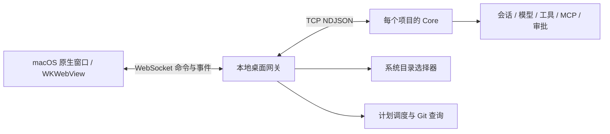

# MiniClaude 桌面应用

独立的 macOS 应用窗口，使用 WKWebView，界面参考 Codex 桌面版。
日常操作通过按钮、系统文件选择器和快捷键完成；命令与状态共用事件连接。

## 启动

```bash
uv sync --extra desktop
uv run --extra desktop mini-desktop
```

生成可双击的应用入口：

```bash
.venv/bin/python scripts/build_macos_app.py
```

打开 `dist/MiniClaude.app`，也可拖入 Dock。首次从项目目录启动，随后恢复上次选择的项目。
使用 `mini-desktop --project /path/to/project` 可以指定初始项目。
应用会自动启动项目 Core；已存在的 Core 通过项目身份校验后复用。
退出时回收本应用启动的所有项目 Core，保留外部已有 Core。
初始窗口按主屏幕的逻辑分辨率留出系统栏边距，最大为 1440×960；小屏幕同时降低最小窗口尺寸。

这是依赖当前 checkout 和 `.venv` 的本机启动器，还不是独立可分发的安装包。
启动日志位于 `~/.mini/desktop/launcher.log`。

## 可以直接操作的功能

| 入口 | 实际行为 |
| --- | --- |
| 项目旁的 +、⌘ O | 打开系统文件夹选择器，切换到该目录的独立 Core |
| 输入框上方项目名 | 紧凑浮层搜索、切换最近项目；点击外部或 Escape 关闭 |
| 侧栏项目 ⋯、选择列表中的 × | 从应用列表移除项目，保留磁盘文件和会话记录 |
| 新对话、最近、置顶、搜索 | 新建与切换会话，搜索标题和已加载正文，置顶、重命名、删除及导出 Markdown |
| 输入框 +、拖入、粘贴 | 读取文本/代码文件内容，支持 PNG、JPEG、WebP、GIF 图片；发送前预览、移除 |
| 模型选择 | 使用当前服务的模型候选或自定义模型名，实际作用于会话后续运行与手动压缩 |
| 工具权限 | 只读、按需审批、完全访问；主代理与子代理使用相同会话权限 |
| 运行中的发送按钮 | 切换为停止按钮，取消模型运行、工具进程、子代理及等待中的审批 |
| 对话内审批卡片 | 允许一次、拒绝、始终允许；断线重连从 Core 恢复仍有效的审批 |
| 改动 | 查看当前分支、工作区文件列表与逐文件 diff，发起对改动的审查对话 |
| Pull Request | 使用本机 GitHub CLI 读取项目真实 PR，点击后在系统浏览器打开 |
| 已安排 | 创建、编辑、暂停、删除单次或每日任务；立即运行、打开运行对话、查看真实结果 |
| 插件 | 添加 stdio/TCP MCP 服务，连接、断开、查看工具，移除由桌面管理的服务 |
| 设置、前进/后退 | 查看与修改会话设置、快捷键说明，返回最近打开的页面与对话 |
| 首页建议 | 了解项目、实现功能、审查改动；点击只填入草稿，确认发送后才开始执行 |
| ⌘/Ctrl B | 展开或收起侧栏；⌘/Ctrl K 搜索对话，Escape 关闭搜索 |
| 回到最新 | 向上阅读时显示，点击回到最新回复；流式输出保持当前阅读位置 |
| 实时事件 | 展示当前会话最近 200 条事件；宽窗口与对话并排，窄窗口在输入框上方切换显示，Escape 关闭并恢复阅读位置 |

输入法正在组字时，回车确认中文或字母，不发送消息；确认输入后，普通 Enter 发送，Shift + Enter 换行。
输入框随内容自动增高，超过上限后内部滚动。输入草稿时仅更新输入区，避免重复渲染整段历史消息。
弹窗打开时，后台页面快捷键暂停；Escape 优先关闭当前弹窗或项目浮层。

文本附件每个最多 256 KB、合计 512 KB；最多 10 个附件。
图片每张最多 5 MB、最多 5 张、合计 10 MB。图片能否被理解取决于所选模型的能力。
附件发送后存入 Core 历史；尚未发送的附件仅留在当前窗口内存，重启后需重新添加。

## 会话、项目与连接

Core 在 `~/.mini/sessions` 持久化会话，并按绝对项目路径隔离。重启后可以继续已有会话。
旧版没有项目归属元数据的记录不会自动归入任意新项目。
置顶、文本草稿和界面缓存按项目保存在 WKWebView 本机数据中。
断线不会自动重发消息，避免重复执行任务。

切换项目时保留旧项目的 Core，因此后台任务不会被切换操作结束。
移除当前项目会切换到下一个已登记项目；移除最后一个后显示空工作区，重启仍保持空列表。
重新打开同一文件夹可以继续原有会话。正在执行任务的项目需先停止任务才能移除。
移除会解除此应用对该项目计划任务的调度，计划文件仍保留，重新打开项目后恢复调度。
普通文件夹没有自己的连接配置时，使用应用已有的默认模型连接。
目标项目明确配置连接时，密钥和地址作为一组使用，禁止混用另一个项目的密钥。
原始连接值不允许 `${...}` 环境替换。默认连接来源只持久化目录路径，密钥不进入项目列表或界面。
首次模型连接配置仍沿用 [README](../README.md) 的环境配置。

默认网关端口为 `7439`，用 `--port` 修改。桌面偏好目录默认 `~/.mini/desktop`，
用 `--storage-path` 指定。macOS WebView 的网站数据由系统管理，固定端口保持相同来源。

## 计划与插件的范围

计划仅在应用打开期间执行，不安装系统后台定时服务。每日任务保持保存时的时区偏移，
按 24 小时间隔推进；任务失败或应用中断后不会自动重试同一次执行。
每个项目只有一个网关拥有计划调度权，避免同时打开桌面与调试网关造成重复执行。

计划保存在项目 `.mini/desktop_schedules.json`；运行锁为 `.mini/desktop_schedules.lock`。
桌面管理的 MCP 配置保存在 `.mini/desktop_mcp.json`。这些本机运行数据已加入 Git 忽略规则。
已有 TOML MCP 配置可连接、断开，但不能从桌面删除其配置来源；桌面添加的服务可以移除。
正在执行任务时暂停插件变更，避免断开仍在使用的工具。

PR 页面需要本机 `gh` 已安装并完成登录，项目具有 GitHub remote。
目前提供 PR 读取和跳转，没有实现 PR 创建、合并、Git 提交推送或内置代码编辑器。
尚无语音输入、账户云同步、插件市场和独立安装包；这些不作为已实现功能展示。

## 事件架构



命令使用 JSON-RPC，模型、工具、审批、项目和计划变更通过事件更新界面。
协议模型及生成文档见 [WIRE_PROTOCOL.md](../WIRE_PROTOCOL.md)。
`mini-web` 保留为浏览器调试入口，日常使用桌面窗口即可。

## 验证

桌面布局优化通过 103 项桌面、网关、会话、审批恢复与项目相关 Python 测试，以及 16 项前端单元测试。
新增 `tests/web/desktop.e2e.js` 的 35 项检查覆盖首页草稿、输入框高度、侧栏快捷键、焦点恢复、事件布局和流式阅读位置；
同时通过 `composer.e2e.js`、`workflows.e2e.js` 和 `projects.e2e.js` 的既有浏览器回归。
布局另在 900×650、1024×700、1280×800、
1920×1080 及 390×844 视口检查输入框和事件面板边界。窗口尺寸适配通过参数化单元测试，
本轮未重新启动用户正在运行的原生桌面窗口。

此前桌面功能实现通过 151 项桌面与核心定向测试、16 项前端单元测试。
保存的 Playwright 流程 `tests/web/workflows.e2e.js` 覆盖 11 个界面检查点，
包括真实 WebSocket 传输、附件内容、恢复审批、停止、续聊和计划执行。
项目管理改动通过 105 项相关 Python 测试；`projects.e2e.js` 覆盖 14 个选择、
移除、空状态和运行保护检查点，`projects.reconnect.e2e.js` 覆盖 5 个双窗口断线恢复检查点。
两个项目测试文件需分别从新启动的夹具运行，避免共享已移除的测试项目列表。
`composer.e2e.js` 覆盖 6 个输入法确认与发送检查点，包括 WebKit 先结束组字再派发回车的事件顺序。

```bash
node --test tests/web/*.test.mjs
.venv/bin/python tests/web/fixture_core.py
```

启动夹具后，用 Playwright 的 `browser_run_code_unsafe` 工具加载 `workflows.e2e.js`。
夹具使用临时目录和模拟模型；不会调用真实模型。MCP、Git、项目切换及进程回收另有专项测试。
已在真实 macOS 窗口核对系统文件夹/附件选择器、切换到无配置文件的目录，以及退出重启后恢复该项目。
已在实际 WKWebView 窗口核对紧凑项目浮层、搜索焦点及侧栏项目操作入口。

完整单元套件此前存在 6 项 `tests/unit/test_compactor.py` 事件循环环境失败，排除桌面新增测试后仍复现；
本轮针对手动压缩的模型选择另有通过的回归测试，未修改这些既有测试。
